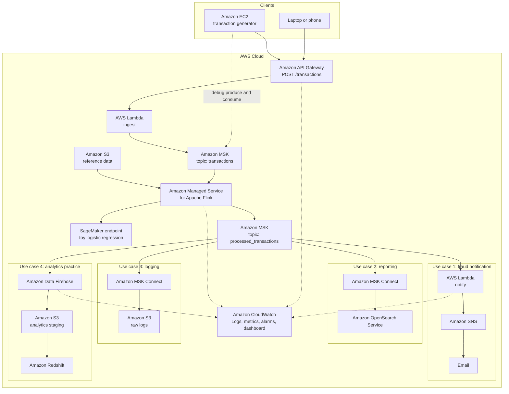

# Real-time fraud detection lab

This lab builds the system in Figure 3-1, **Real-time fraud detection system**, on your own AWS account, then adds four services so you can practice them on the same stream:

| You asked for | Service you will open in the console |
| --- | --- |
| EC2 | Amazon EC2 |
| Firehorse | **Amazon Data Firehose** (the service was renamed from Kinesis Data Firehose) |
| Watchlog | **Amazon CloudWatch**, especially CloudWatch Logs |
| Redshift | Amazon Redshift Serverless |

The folder is named `realtime-kinesis`, and the figure is a **Kafka** design. The bus in the diagram is Amazon MSK (Managed Streaming for Apache Kafka), not Kinesis Data Streams. Firehose is the delivery service from the Kinesis family, and in this lab it reads the Kafka topic and lands files in S3 for Redshift.

Work in one Region the whole way. The steps use **us-east-1**. If you pick another Region, keep every ARN, bootstrap string, and console URL in that same Region.

Figure 3-1 draws **Amazon Fraud Detector** beside Flink. AWS stopped accepting new Fraud Detector customers on November 7, 2025, and the service reaches end of support on October 7, 2026. This lab puts a small **Amazon SageMaker** endpoint in that box. You train a one-feature logistic regression, deploy it for real-time inference, and Flink calls `InvokeEndpoint` on every transaction.

You write the application code yourself while you build. Each phase below tells you which file to create, what it must do, and the source to type. Nothing in this folder is a finished Lambda or Flink app.

| File you create | Phase | Runs as |
| --- | --- | --- |
| `train_toy_model.py` | 4 | Trains the logistic regression on your laptop |
| `inference.py` | 4 | SageMaker endpoint code that scores one amount |
| `main.py` | 6 | Managed Flink application |
| `aws_api_gateway.py` | 7 | Ingest Lambda behind API Gateway |
| `generate_data_ec2.py` | 7 | EC2 (or laptop) transaction generator |
| `notify_lambda.py` | 8 | Notification Lambda |

`reference/customers.json` is already in this folder. That file is data, not application code. You upload it to S3 in phase 3.

---

## Cost before you click anything

Several resources charge **per hour while they exist**, even when no transactions are flowing.

| Resource | When the bill grows |
| --- | --- |
| NAT Gateway | Every hour it exists, plus data processed |
| MSK brokers (`kafka.t3.small` × 2) | Every hour the cluster exists |
| Managed Flink application | Every hour the application is **running**. A small app is billed at about 2 KPUs (1 for the job, 1 for orchestration). **Stop** the application when you pause. |
| OpenSearch domain | Every hour the domain exists |
| MSK Connect workers | Every hour each connector worker exists |
| EC2 | Every hour the instance is running. Stop it when you pause; stopping does not delete the disk. |
| Redshift Serverless | Compute while the workgroup is in use. Delete the workgroup when you are done for the day. |
| SageMaker endpoint | This lab uses **serverless** inference, billed per request. A provisioned `ml.*` instance bills every hour it exists. Delete the endpoint when you stop. |
| Firehose, Lambda, API Gateway, SNS, S3, CloudWatch | Mostly usage-based. A few synthetic events cost cents. Logs you forget to delete cost storage later. |

Create an AWS Budget before the cluster. A **$25 monthly** cost budget with an email alert is a reasonable safety rail for a first run. Raise it if you intend to leave the stack up for several days. Search the console for **AWS Budgets → Create budget → Customize → Cost budget**, set the amount, and add your email.

When you stop practicing, follow [Tear down](#tear-down) the same day. The expensive items are NAT, MSK, a running Flink app, OpenSearch, and MSK Connect.

Tag every resource `Project = fraud-lab` so you can find stragglers.

---

## Architecture

Solid arrows are the path of a transaction. The dashed arrow is a debug path: the EC2 instance can also talk to MSK directly so you can inspect topics while you learn. CloudWatch is drawn once because every component sends logs or metrics to it.



Figure 3-1 is the left-to-right stream plus use cases 1, 2, and 3. The SageMaker box replaces Fraud Detector. This lab also adds use case 4 and the CloudWatch plane.

### How one transaction moves

1. The EC2 generator (or your laptop) POSTs a JSON payment to API Gateway.
2. API Gateway invokes the ingest Lambda. API Gateway has no native “write to MSK” integration, so this Lambda is the Kafka producer. It writes the record to the topic `transactions`, using `customer_id` as the partition key.
3. Managed Flink reads that topic. For each event it:
   - looks up the customer in the S3 reference file (home country, risk tier, account age)
   - counts how many events that same customer produced in the last 5 minutes (Flink keyed state)
   - calls the SageMaker endpoint with the transaction amount and reads back a fraud probability
   - writes one scored JSON record to the topic `processed_transactions`
4. Three original consumers, plus Firehose, read that output topic independently. Each has its own consumer group, so each receives every record.
   - **Notification.** A Lambda function publishes to SNS only when `fraud_outcome` is `review`. SNS emails you.
   - **Reporting.** MSK Connect writes the same records into OpenSearch so you can search them.
   - **Logging.** A second MSK Connect connector writes raw JSON files to S3.
   - **Analytics.** Firehose buffers the topic and writes newline-delimited JSON to a different S3 prefix. You `COPY` that prefix into Redshift and query it with SQL.
5. CloudWatch receives Lambda logs, API Gateway access logs, Flink logs, Firehose delivery logs, and MSK metrics the whole time.

Latencies are different on purpose. Learn these numbers so a “missing” record is not a false alarm:

| Hop | What you should expect |
| --- | --- |
| API Gateway → MSK | A few seconds. The Lambda returns `202` only after the broker ack. |
| MSK → Flink → output topic → email | Usually under a minute after the Flink app is running and the SNS subscription is confirmed. The first SageMaker call after the endpoint has been idle can take longer, because serverless inference starts a container. |
| Firehose → S3 | The lab buffer is **60 seconds** or **1 MB**, whichever comes first. Tiny events wait for the timer. |
| S3 → Redshift | Happens when **you** run `COPY`. Firehose does not load Redshift by itself in this lab. |

### Record shapes

Ingest record, produced by the Lambda you write in phase 7:

```json
{
  "transaction_id": "0c1d...",
  "event_timestamp": "2026-09-27T15:04:05Z",
  "customer_id": "cust_002",
  "merchant_id": "merch_12",
  "amount": 850.0,
  "currency": "USD",
  "country": "NG",
  "card_present": false,
  "ip_address": "203.0.113.44"
}
```

Scored record, produced by Flink. Downstream systems all use this shape.

```json
{
  "transaction_id": "0c1d...",
  "event_timestamp": "2026-09-27T15:04:05Z",
  "customer_id": "cust_002",
  "merchant_id": "merch_12",
  "amount": 850.0,
  "currency": "USD",
  "country": "NG",
  "card_present": false,
  "ip_address": "203.0.113.44",
  "home_country": "US",
  "risk_tier": "medium",
  "account_age_days": 40,
  "country_mismatch": true,
  "txn_count_5m": 4,
  "velocity_flag": true,
  "model_outcome": "review",
  "model_score": 0.97,
  "stream_reasons": "country_mismatch,velocity",
  "fraud_outcome": "review",
  "processed_at": "2026-09-27T15:04:06Z"
}
```

Who sets `fraud_outcome`:

- The SageMaker model returns a probability in `model_score`. Flink sets `model_outcome` to `review` when that score is at least `0.5`, and to `approve` otherwise. The toy model was trained so amounts over about 400 score high and smaller amounts score low.
- Flink overrides the final `fraud_outcome` to `review` when the customer transacts outside their home country for more than $200, or when they send 4 or more events in five minutes.
- A small amount can still be `fraud_outcome` `review` when the stream rules fire. `model_outcome` stays `approve` in that case, so you can see which component made the decision.

### Names used in every step

```text
Region                         us-east-1
VPC                            fraud-lab-vpc          10.20.0.0/16
Public subnet A                fraud-lab-public-a     10.20.0.0/24
Public subnet B                fraud-lab-public-b     10.20.1.0/24
Private subnet A               fraud-lab-private-a    10.20.10.0/24
Private subnet B               fraud-lab-private-b    10.20.11.0/24
NAT Gateway                    fraud-lab-nat
S3 bucket                      fraud-lab-<ACCOUNT_ID>-us-east-1
MSK cluster                    fraud-lab-msk
Input topic                    transactions
Output topic                   processed_transactions
EC2                            fraud-lab-generator
Ingest Lambda                  fraud-lab-ingest
API                            fraud-lab-api
SageMaker model                fraud-lab-toy
SageMaker endpoint             fraud-lab-endpoint
Flink app                      fraud-lab-flink
Notify Lambda                  fraud-lab-notify
SNS topic                      fraud-lab-alerts
Firehose stream                fraud-lab-scored
Redshift namespace             fraud-lab-ns
Redshift workgroup             fraud-lab-wg
OpenSearch domain              fraud-lab-search
```

```bash
aws sts get-caller-identity --query Account --output text
```

Substitute that value wherever you see `<ACCOUNT_ID>`.

---

## What each component is doing

Read this section before the console steps. The steps tell you what to click. This section is why the click exists.

### Amazon EC2

EC2 is a virtual machine you run in your VPC. In production the clients are the shopper’s phone and the merchant’s backend, drawn outside the AWS cloud in the figure. For a lab you need a machine you control that can:

- call the public API Gateway endpoint, which is the real client path
- open a Kafka client to the **private** MSK brokers, which a laptop on your home network cannot do
- `curl` OpenSearch, which also lives on private IPs

The instance is Amazon Linux 2023, size `t3.micro`, in the public subnet, with a public IP so you can SSH. Its instance profile (an IAM role attached to the instance) is allowed to produce and consume both topics. You do not copy access keys onto the box.

The generator script only speaks HTTP. Kafka inspection is a separate set of commands, so a bug in the API is not confused with a bug in the broker.

### Amazon API Gateway

API Gateway is the front door. Callers hit a stable HTTPS URL. They never see brokers, subnets, or IAM.

The lab uses an **HTTP API** (the cheaper, smaller API Gateway mode) with one route, `POST /transactions`, and a Lambda proxy integration. HTTP APIs and REST APIs both satisfy the box in the figure. REST APIs add API keys, usage plans, and request validation; you do not need those to learn the stream.

Turn on **access logs** to CloudWatch while you create the stage. Each line is one request: IP, route, status, latency. That log is the first place to look when the generator prints an HTTP error.

A `202` from the Lambda means “MSK accepted the record,” not “the payment is approved.” Approval happens later, on the stream. Returning before scoring keeps the checkout path short. The caller can poll another API, or wait for the email, if they need the decision. This lab does not build that read API.

### AWS Lambda, ingest

The ingest function, which you write in phase 7 as `aws_api_gateway.py`, validates the body, fills `transaction_id` and `event_timestamp`, and produces one Kafka record.

The function runs **inside the VPC**, in the private subnets, because the MSK brokers have no public endpoint. Lambda’s own service still invokes it; you do not expose the function to the internet. API Gateway reaches Lambda through the Lambda service, then the function’s network interface reaches MSK on port **9098** (the IAM-auth broker port).

The Kafka client uses IAM (`OAUTHBEARER` plus `aws-msk-iam-sasl-signer`). There is no username or password. The function’s execution role is the identity MSK checks.

`acks=all` waits until the record is replicated to the in-sync replicas. Combined with `future.get()`, the HTTP call fails if MSK did not take the write. That is the behavior you want while learning. A high-volume API would return sooner and handle a failed ack with a retry queue.

CloudWatch Logs for this function is the log group `/aws/lambda/fraud-lab-ingest`. A timeout almost always means the security group path to port 9098 is closed, or the bootstrap string is the TLS port (9094) instead of the IAM port (9098).

### Amazon MSK

MSK runs Apache Kafka for you: brokers, software patches, and replication. You still choose instance size, storage, subnets, authentication, and topics.

One cluster holds two topics:

| Topic | Partitions | Replication | Who writes | Who reads |
| --- | --- | --- | --- | --- |
| `transactions` | 2 | 2 | Ingest Lambda, and you when debugging from EC2 | Flink |
| `processed_transactions` | 2 | 2 | Flink | Notify Lambda, two MSK Connect connectors, Firehose, and you from EC2 |

Two partitions match two brokers. The producer key is `customer_id`, so every event for `cust_002` lands on the same partition. Flink’s count of “events in the last five minutes” is local to that partition. If you produced with a random key, the count would be wrong unless the cluster had one partition.

Replication factor 2 means each partition has a copy on both brokers. `acks=all` does not succeed unless that copy exists. With two brokers, replication factor 3 is impossible. A production cluster usually has three brokers and replication factor 3.

Authentication is **IAM**. Encryption in transit is TLS. Public access stays off. Clients inside the VPC use the bootstrap string `BootstrapBrokerStringSaslIam`, hostnames ending in port 9098.

Kafka consumer groups are how several readers share a topic without stealing records from each other:

| Consumer group | Reader |
| --- | --- |
| `fraud-lab-flink` | Flink |
| the group Lambda creates for the event source mapping | Notify Lambda |
| the group each connector sets | MSK Connect |
| the group Firehose sets | Firehose |
| `fraud-lab-debug` | Your manual console consumer on EC2 |

MSK is the component that keeps billing after you stop Flink. Stopping the stream processor does not stop the brokers.

### Amazon S3, reference data

S3 is object storage. The fraud job uses four prefixes in **one** bucket so the lab has a single thing to empty at the end.

| Prefix | Written by | Read by |
| --- | --- | --- |
| `reference/customers.json` | You, once | Flink, at startup |
| `flink-snapshots/` | Managed Flink | Managed Flink, on restart |
| `analytics/scored/` | Firehose | Redshift `COPY` |
| `logs/connect/` | MSK Connect S3 sink | You, and anything you point at the data lake later |
| `models/fraud-toy/` | You | SageMaker, to download the model and `inference.py` |
| `plugins/` | You | MSK Connect, to download connector zips |

`reference/customers.json` is newline-delimited JSON, one customer per line. Flink loads it into a dictionary in `open()`, which runs once per parallel subtask when the job starts. That matches the arrow from S3 into Flink in the figure: the stream is enriched with data that changes slowly (home country, risk tier, account age).

A production job would refresh that file on a timer or broadcast a second stream. This lab restarts the Flink application when you change the file. Restarting is acceptable because the file is tiny and the point is to see the join.

The bucket blocks all public access. Nothing in this lab needs a public object.

An **S3 gateway VPC endpoint** on the private route table lets Flink, Redshift, and MSK Connect reach S3 without sending that traffic through the NAT Gateway. The endpoint is free. NAT is still required for `InvokeEndpoint`, because the SageMaker runtime API is reached over the public service endpoint.

### Amazon SageMaker endpoint

SageMaker hosts the model that used to be Amazon Fraud Detector in the figure. The lab model is deliberately small: a scikit-learn logistic regression with a single input, `amount`. You label the training rows yourself (`1` when amount is at least 400, `0` otherwise), fit the model on your laptop, and deploy it to a **serverless** endpoint. Flink sends `{"amount": 850}` and reads back `{"score": 0.97, "prediction": 1}`.

Serverless means there is no `ml.*` instance running between calls. You pay for inference time. The first call after a quiet period waits while SageMaker starts the container. A provisioned real-time instance skips that wait and bills every hour, which is the wrong default for this lab.

| Piece | Lab value | Meaning |
| --- | --- | --- |
| Algorithm | `LogisticRegression` in scikit-learn 1.2.1 | Must match the inference container. A model pickled with a newer scikit-learn fails to load. |
| Feature | `amount` only | One number in, one probability out. |
| Label | `1` if amount ≥ 400, else `0` | The model learns the same cut the old rules used, so the rest of the lab stays predictable. |
| Artifact | `model.tar.gz` containing `model.joblib` | What the endpoint downloads from S3. |
| Entry point | `inference.py` in `sourcedir.tar.gz` | `model_fn`, `input_fn`, `predict_fn`, `output_fn`. |
| Endpoint | `fraud-lab-endpoint`, serverless, 1024 MB, concurrency 1 | The URL Flink calls. |
| Decision | score ≥ 0.5 → `review` | Applied in Flink, from the runtime property `score.threshold`. |

`InvokeEndpoint` is a public AWS API. The Flink nodes sit in private subnets, so the NAT Gateway is what makes this call possible. The IAM action is `sagemaker:InvokeEndpoint` on the endpoint ARN. The client in code is `boto3.client("sagemaker-runtime")`, which is a different service name from the control-plane client `boto3.client("sagemaker")` you use to create the endpoint.

### Amazon Managed Service for Apache Flink

Flink is the stream processor. Managed Flink runs the Flink cluster for you. You upload a Python zip and an IAM role. The console name is **Amazon Managed Service for Apache Flink**. Older docs say “Kinesis Data Analytics for Apache Flink”; the application role still trusts `kinesisanalytics.amazonaws.com`.

The job you write in phase 6 as `main.py` is one pipeline:

1. **Source.** Kafka consumer on `transactions`, IAM auth, starting at **latest** so a redeploy does not rescore the whole history.
2. **Key by** `customer_id`.
3. **Process function.** Keyed state (`ListState` of timestamps) keeps the 5-minute velocity count. The same function loads reference data, calls the SageMaker endpoint, and emits one JSON string.
4. **Sink.** Kafka producer to `processed_transactions`.

Checkpointing is every 60 seconds, stored in `s3://<bucket>/flink-snapshots/`. On a crash, Managed Flink restarts from the last successful checkpoint, including the velocity state and the Kafka offsets. That is the reason to use Flink here instead of a Lambda that forgets everything when the invocation ends.

Parallelism is 1. Combined with two partitions, one subtask reads both partitions. That is enough for a handful of events per second and keeps the KPU count at the minimum.

Print statements such as `FLINK_SCORED ...` show up in the Flink CloudWatch log group once logging is enabled. Enable it at creation time.

The application must be attached to the private subnets and to `sg-flink`. Managed Flink creates network interfaces in those subnets. Those interfaces need a route to MSK (security groups) and a route to the internet (NAT) for the SageMaker runtime API.

Stop the application from the console when you are not sending events. Deleting the VPC while a Flink app is still running leaves network interfaces behind and blocks VPC deletion.

### Amazon MSK, output topic, and fan-out

The second MSK box in the figure is the same cluster, second topic. Fan-out is “several consumer groups on one topic,” not a second cluster. Running two clusters would double the broker bill and teach the same idea.

A consumer group stores its offsets in Kafka. If the notify Lambda is down for ten minutes, it continues from the last committed offset when it returns, as long as the records are still inside the topic retention window (the cluster default is several days). Firehose and the connectors do not care that Lambda was down. That independence is the point of the bus.

### AWS Lambda and Amazon SNS, use case 1

The notify function, which you write in phase 8 as `notify_lambda.py`, is invoked by an **event source mapping** that polls `processed_transactions` and passes the function a batch. The function does not need to run inside the VPC: the Lambda service makes the Kafka connection, and the function only calls SNS, which is a public API.

Each record’s `value` arrives **base64-encoded**. The function decodes it, and publishes to SNS only when `fraud_outcome` is `review`. Approved transactions stay on the topic for search, logs, and the warehouse, and they do not send email.

SNS is a pub/sub bus. This lab has one subscriber, an email address. You must click the confirmation link or no mail is delivered. The topic can later gain an SMS subscriber or another Lambda without changing Flink.

The function prints `FRAUD_ALERT <transaction_id>`. A CloudWatch metric filter on that phrase turns “an email was attempted” into a graph.

### Amazon MSK Connect and Amazon OpenSearch Service, use case 2

MSK Connect runs Kafka Connect workers. A connector is a config file plus a plugin jar, not an application you patch. The OpenSearch sink reads `processed_transactions` and indexes each JSON value as a document.

OpenSearch is a search engine. It answers “show me the last 20 reviews for `cust_005`” or “filter `velocity_flag: true`” in milliseconds. It is a weak place to compute “fraud rate by merchant for the last quarter across billions of rows.” That question belongs to Redshift. The two stores are in this lab so you can feel that split.

The domain is one `t3.small.search` node, inside the VPC, fine-grained access control on, zone awareness off. One node will not survive an AZ failure. That is acceptable for a lab and is the main reason this domain is cheap enough to create.

You query it from EC2 with basic auth. The domain has no public endpoint.

### Amazon MSK Connect and Amazon S3, use case 3

The S3 sink connector is the logging path from the figure. It writes the Kafka records as JSON objects under `logs/connect/`. Flush size is 10 records so a short generator run still produces a file. A production connector flushes on a larger size or a time rotation so you do not create millions of tiny objects.

This path and the Firehose path both end in S3. They are different tools:

| | MSK Connect S3 sink | Data Firehose |
| --- | --- | --- |
| How you operate it | A connector and worker nodes you size | A delivery stream, no servers |
| Output in this lab | `logs/connect/` | `analytics/scored/` |
| Buffer | Flush after N records | 60 seconds or 1 MB |
| Format conversion, dynamic partitioning | Possible, more config | Built in, and this lab leaves it as JSON |
| Best practice question it answers | “How does the figure’s logging box work?” | “How do I land a stream in a warehouse?” |

### Amazon Data Firehose, use case 4

Firehose reads a source and delivers files to a destination. You do not run consumers or manage shards.

This stream’s source is the MSK topic `processed_transactions`. The MSK integration delivers to **S3**. (The console will only offer S3 once the source is MSK.) Firehose creates network interfaces in your private subnets, joins the topic with IAM, batches records, and puts objects under `analytics/scored/`.

Turn on **newline delimiter** so each Kafka record becomes one line. Redshift’s `COPY ... FORMAT AS JSON 'auto'` reads that shape.

Turn on **error logging** to CloudWatch. The log group is `/aws/kinesisfirehose/fraud-lab-scored`. Delivery failures (a missing `s3:PutObject`, a bad prefix) show up there as the stream `S3Delivery`. The Firehose metric `DeliveryToS3.Success` is the graph form of the same fact.

Buffer hints for the lab: 1 MB and 60 seconds. The 60-second floor is a service minimum. Sending one event and refreshing S3 immediately will show an empty prefix. Wait one minute.

Firehose can also target Redshift directly, from a **Direct PUT** or **Kinesis Data Streams** source. That mode still writes S3 first, then issues `COPY` itself. It requires the Redshift workgroup to be **publicly reachable**, with the Firehose IP range allowed in the security group. This lab keeps Redshift private and runs `COPY` by hand, because the MSK source delivers to S3, and because a public warehouse is a poor default. The optional section at the end shows the public path if you want to practice that checkbox.

### Amazon Redshift

Redshift is a columnar SQL warehouse. You load scored transactions and ask analytical questions: fraud rate by merchant, reviews per risk tier, amount percentiles. Those queries scan a column across many rows. OpenSearch is the opposite shape, an index on individual documents.

The lab uses **Redshift Serverless**: a namespace (storage, database, IAM role) and a workgroup (compute, subnets, security group). There is no cluster size to pick beyond a maximum RPU cap. Set the maximum to the smallest value the console allows so a runaway query cannot scale the warehouse up.

The table `scored_transactions` matches the Flink JSON keys. `COPY` from the analytics prefix uses an IAM role on the namespace, not a database password, to read S3. Enable **enhanced VPC routing** and rely on the S3 gateway endpoint so that copy stays inside the VPC.

Redshift does not enforce primary keys. Running `COPY` twice on the same files inserts duplicates. Load a specific hour prefix, or delete from the table before a second full load.

The console **Query editor v2** is how you run SQL. You do not open port 5439 to the internet.

### Amazon CloudWatch

CloudWatch is the observability plane.

- **Logs** are the text each service emits. Lambda and Flink print lines. API Gateway writes one access-log line per request. Firehose writes delivery errors. This is the “Watchlog” practice.
- **Metrics** are numbers over time: MSK `BytesInPerSec`, Lambda `Errors`, Firehose `IncomingRecords`, API Gateway `5XXError`.
- **Metric filters** convert a log phrase (`FRAUD_ALERT`) into a metric you can graph and alarm on.
- **Alarms** watch a metric and can notify the same SNS topic.
- **Dashboards** put those graphs on one page.
- **Logs Insights** is the query box over a log group.

Create the log groups while you create each service. Build the dashboard after data exists, or the widgets will be empty and look broken.

MSK broker log shipping is optional and noisy. Leave it off until you are debugging the cluster itself. Topic-level metrics are enough to see that the generator is producing.

---

## Build order

MSK takes 20–40 minutes to become Active. Start it as soon as the VPC exists, then build S3, IAM, and the SageMaker endpoint while you wait.

| Phase | You finish when |
| --- | --- |
| 1. Budget and VPC | Private subnets route to NAT, and an S3 gateway endpoint is on the private route table |
| 2. MSK | Cluster status is Active |
| 3. S3 and IAM | Bucket exists, roles exist |
| 4. SageMaker endpoint | `aws sagemaker-runtime invoke-endpoint` returns a score near 1 for amount 850 and near 0 for amount 20 |
| 5. EC2 and topics | You can produce and consume a test record |
| 6. Flink | A test record appears on `processed_transactions` with `fraud_outcome` set |
| 7. API Gateway and ingest Lambda | `curl` returns `202` and Flink scores that record |
| 8. SNS and notify Lambda | A review event sends an email |
| 9. Firehose | A new object appears under `analytics/scored/` within two minutes |
| 10. Redshift | `SELECT COUNT(*)` returns the rows you loaded |
| 11. CloudWatch dashboard | The dashboard shows the request you just sent |
| 12. MSK Connect | A log object is in `logs/connect/` and a document is in OpenSearch |

Phases 11 and 12 can wait until the next sitting. Phases 1–10 are the path that proves the design.

---

## Phase 1. Network

You need a VPC with two Availability Zones. MSK, Flink, Firehose, and Redshift all refuse to run in a single subnet.

In the VPC console, create a VPC **manually** (the wizard’s “public and private” preset is fine if you then fix the names and CIDRs below).

| Resource | Value |
| --- | --- |
| VPC CIDR | `10.20.0.0/16` |
| Public subnet A | `10.20.0.0/24` in the first AZ, name `fraud-lab-public-a` |
| Public subnet B | `10.20.1.0/24` in the second AZ, name `fraud-lab-public-b` |
| Private subnet A | `10.20.10.0/24` in the first AZ, name `fraud-lab-private-a` |
| Private subnet B | `10.20.11.0/24` in the second AZ, name `fraud-lab-private-b` |
| Internet gateway | `fraud-lab-igw`, attached to the VPC |
| Public route table | `0.0.0.0/0` → internet gateway. Associated with both public subnets. |
| NAT Gateway | In `fraud-lab-public-a`, name `fraud-lab-nat`. Allocate an Elastic IP for it. |
| Private route table | `0.0.0.0/0` → `fraud-lab-nat`. Associated with both private subnets. |

One NAT in a single AZ is a lab shortcut. If that AZ fails, private subnets in both AZs lose internet access. A production VPC puts a NAT in each AZ.

S3 gateway endpoint:

1. VPC → Endpoints → Create endpoint.
2. Service: `com.amazonaws.us-east-1.s3`, type Gateway.
3. VPC: `fraud-lab-vpc`.
4. Route tables: the **private** route table.
5. Name: `fraud-lab-s3`.

Security groups. Leave the default outbound rule (all traffic) on each of them.

| Security group | Inbound |
| --- | --- |
| `sg-msk` | TCP 9098 from `sg-ec2`, `sg-lambda`, `sg-flink`, `sg-firehose`, `sg-connect` |
| `sg-ec2` | TCP 22 from your current public IP `/32` |
| `sg-lambda` | none |
| `sg-flink` | none |
| `sg-firehose` | none |
| `sg-connect` | none |
| `sg-opensearch` | TCP 443 from `sg-ec2` and `sg-connect` |
| `sg-redshift` | none from the internet. Query editor v2 does not need an inbound rule from your laptop. |

Your IP changes. When SSH starts timing out, update `sg-ec2`.

Checkpoint: in the private route table you see `0.0.0.0/0` to the NAT and a prefix-list route to the S3 endpoint.

---

## Phase 2. Start the MSK cluster

Create this now so it can provision while you do phases 3 and 4.

MSK → Clusters → Create cluster.

| Setting | Value |
| --- | --- |
| Creation method | Custom create |
| Cluster name | `fraud-lab-msk` |
| Cluster type | Provisioned |
| Apache Kafka version | The recommended version the console offers |
| Broker type | `kafka.t3.small` |
| Brokers | 2 |
| Broker storage | 10 GiB |
| Apache ZooKeeper or KRaft | Leave the console default |
| VPC | `fraud-lab-vpc` |
| Subnets | `fraud-lab-private-a` and `fraud-lab-private-b` only |
| Security group | `sg-msk` |
| Public access | Off |
| Authentication | IAM access control. Clear unauthenticated and SASL/SCRAM. |
| Encryption in transit | TLS, required |
| Monitoring | Per topic |

Create the cluster. Continue below while the status is Creating.

---

## Phase 3. S3 bucket and IAM roles

### Bucket

```bash
ACCOUNT_ID=$(aws sts get-caller-identity --query Account --output text)
BUCKET="fraud-lab-${ACCOUNT_ID}-us-east-1"
aws s3 mb "s3://${BUCKET}" --region us-east-1
aws s3api put-public-access-block \
  --bucket "$BUCKET" \
  --public-access-block-configuration BlockPublicAcls=true,IgnorePublicAcls=true,BlockPublicPolicy=true,RestrictPublicBuckets=true
```

Upload the reference file from this folder:

```bash
aws s3 cp reference/customers.json "s3://${BUCKET}/reference/customers.json"
```

Add a lifecycle rule that expires objects under `logs/` and `analytics/` after 7 days. S3 → bucket → Management → Lifecycle rules → prefix `logs/`, and a second rule for `analytics/`. The reference file and the connector plugins sit outside those prefixes, so the rule will not delete them.

### How MSK IAM policies are shaped

MSK checks two namespaces:

- `kafka:` actions (`GetBootstrapBrokers`, `DescribeCluster`) are the control plane. Your console user already has these if you can create the cluster.
- `kafka-cluster:` actions are the data plane, checked on every produce and consume. The resource ARNs use `cluster/`, `topic/`, and `group/`.

After the cluster is Active, this prints the cluster ARN and the UUID inside it:

```bash
aws kafka list-clusters-v2 --region us-east-1 \
  --query "ClusterInfoList[?ClusterName=='fraud-lab-msk'].ClusterArn" --output text
```

In the policies below, `cluster/fraud-lab-msk/*` matches that cluster. If an `AccessDenied` message quotes a full topic ARN, paste that ARN into the policy. The usual miss is a policy that allows the cluster ARN and omits the topic ARN.

### Trust policies

Lambda roles trust `lambda.amazonaws.com`. Flink trusts `kinesisanalytics.amazonaws.com`. Firehose trusts `firehose.amazonaws.com`. MSK Connect trusts `kafkaconnect.amazonaws.com`. EC2 trusts `ec2.amazonaws.com`. Redshift trusts `redshift.amazonaws.com`.

Example, the ingest role:

```bash
aws iam create-role \
  --role-name fraud-lab-lambda-ingest-role \
  --assume-role-policy-document '{
    "Version": "2012-10-17",
    "Statement": [{
      "Effect": "Allow",
      "Principal": {"Service": "lambda.amazonaws.com"},
      "Action": "sts:AssumeRole"
    }]
  }'
```

Create the same way, changing the role name and the service principal:

| Role | Principal |
| --- | --- |
| `fraud-lab-lambda-ingest-role` | `lambda.amazonaws.com` |
| `fraud-lab-lambda-notify-role` | `lambda.amazonaws.com` |
| `fraud-lab-flink-role` | `kinesisanalytics.amazonaws.com` |
| `fraud-lab-firehose-role` | `firehose.amazonaws.com` |
| `fraud-lab-connect-role` | `kafkaconnect.amazonaws.com` |
| `fraud-lab-ec2-role` | `ec2.amazonaws.com` |
| `fraud-lab-redshift-copy-role` | `redshift.amazonaws.com` |
| `fraud-lab-sagemaker-role` | `sagemaker.amazonaws.com` |

Attach the AWS managed policy `AWSLambdaVPCAccessExecutionRole` to **both** Lambda roles. It covers CloudWatch Logs and the network interfaces a VPC function creates. The notify function stays outside the VPC; the managed policy is still a simple way to grant its log permissions.

Attach `AmazonSSMManagedInstanceCore` to the EC2 role if you want Session Manager as a backup to SSH. Optional.

### Ingest role, data-plane policy

Save as `ingest-policy.json` (replace the Region and account if needed) and attach it to `fraud-lab-lambda-ingest-role`.

```json
{
  "Version": "2012-10-17",
  "Statement": [
    {
      "Effect": "Allow",
      "Action": ["kafka-cluster:Connect", "kafka-cluster:DescribeCluster"],
      "Resource": "arn:aws:kafka:us-east-1:<ACCOUNT_ID>:cluster/fraud-lab-msk/*"
    },
    {
      "Effect": "Allow",
      "Action": [
        "kafka-cluster:DescribeTopic",
        "kafka-cluster:WriteData"
      ],
      "Resource": "arn:aws:kafka:us-east-1:<ACCOUNT_ID>:topic/fraud-lab-msk/*"
    }
  ]
}
```

```bash
aws iam put-role-policy \
  --role-name fraud-lab-lambda-ingest-role \
  --policy-name fraud-lab-ingest-msk \
  --policy-document file://ingest-policy.json
```

### Notify role

The event source mapping also needs permission to describe the cluster and to join a consumer group.

```json
{
  "Version": "2012-10-17",
  "Statement": [
    {
      "Effect": "Allow",
      "Action": [
        "kafka:DescribeCluster",
        "kafka:GetBootstrapBrokers",
        "kafka:ListScramSecrets"
      ],
      "Resource": "arn:aws:kafka:us-east-1:<ACCOUNT_ID>:cluster/fraud-lab-msk/*"
    },
    {
      "Effect": "Allow",
      "Action": ["kafka-cluster:Connect", "kafka-cluster:DescribeCluster"],
      "Resource": "arn:aws:kafka:us-east-1:<ACCOUNT_ID>:cluster/fraud-lab-msk/*"
    },
    {
      "Effect": "Allow",
      "Action": [
        "kafka-cluster:DescribeTopic",
        "kafka-cluster:ReadData"
      ],
      "Resource": "arn:aws:kafka:us-east-1:<ACCOUNT_ID>:topic/fraud-lab-msk/*"
    },
    {
      "Effect": "Allow",
      "Action": [
        "kafka-cluster:AlterGroup",
        "kafka-cluster:DescribeGroup"
      ],
      "Resource": "arn:aws:kafka:us-east-1:<ACCOUNT_ID>:group/fraud-lab-msk/*"
    },
    {
      "Effect": "Allow",
      "Action": "sns:Publish",
      "Resource": "arn:aws:sns:us-east-1:<ACCOUNT_ID>:fraud-lab-alerts"
    }
  ]
}
```

Attach that inline policy to `fraud-lab-lambda-notify-role`.

### Flink role

```json
{
  "Version": "2012-10-17",
  "Statement": [
    {
      "Effect": "Allow",
      "Action": [
        "kafka-cluster:Connect",
        "kafka-cluster:DescribeCluster",
        "kafka-cluster:ReadData",
        "kafka-cluster:WriteData",
        "kafka-cluster:DescribeTopic",
        "kafka-cluster:DescribeGroup",
        "kafka-cluster:AlterGroup"
      ],
      "Resource": [
        "arn:aws:kafka:us-east-1:<ACCOUNT_ID>:cluster/fraud-lab-msk/*",
        "arn:aws:kafka:us-east-1:<ACCOUNT_ID>:topic/fraud-lab-msk/*",
        "arn:aws:kafka:us-east-1:<ACCOUNT_ID>:group/fraud-lab-msk/*"
      ]
    },
    {
      "Effect": "Allow",
      "Action": ["s3:GetObject"],
      "Resource": "arn:aws:s3:::fraud-lab-<ACCOUNT_ID>-us-east-1/reference/*"
    },
    {
      "Effect": "Allow",
      "Action": ["s3:ListBucket"],
      "Resource": "arn:aws:s3:::fraud-lab-<ACCOUNT_ID>-us-east-1"
    },
    {
      "Effect": "Allow",
      "Action": ["s3:GetObject", "s3:PutObject", "s3:DeleteObject", "s3:ListBucket"],
      "Resource": [
        "arn:aws:s3:::fraud-lab-<ACCOUNT_ID>-us-east-1",
        "arn:aws:s3:::fraud-lab-<ACCOUNT_ID>-us-east-1/flink-snapshots/*"
      ]
    },
    {
      "Effect": "Allow",
      "Action": ["sagemaker:InvokeEndpoint"],
      "Resource": "arn:aws:sagemaker:us-east-1:<ACCOUNT_ID>:endpoint/fraud-lab-endpoint"
    },
    {
      "Effect": "Allow",
      "Action": [
        "logs:DescribeLogGroups",
        "logs:DescribeLogStreams",
        "logs:PutLogEvents",
        "logs:CreateLogStream"
      ],
      "Resource": "*"
    },
    {
      "Effect": "Allow",
      "Action": [
        "ec2:CreateNetworkInterface",
        "ec2:CreateNetworkInterfacePermission",
        "ec2:DescribeNetworkInterfaces",
        "ec2:DescribeVpcs",
        "ec2:DescribeSubnets",
        "ec2:DescribeSecurityGroups",
        "ec2:DeleteNetworkInterface",
        "ec2:AssignPrivateIpAddresses",
        "ec2:UnassignPrivateIpAddresses"
      ],
      "Resource": "*"
    }
  ]
}
```

`sagemaker:InvokeEndpoint` is scoped to `fraud-lab-endpoint`. Create the endpoint in phase 4 before you run Flink. The action name is `sagemaker:` even though the boto3 client is `sagemaker-runtime`.

### Firehose role

Firehose needs the data-plane read, permission to place its network interfaces, and permission to write the analytics prefix and the error log group.

```json
{
  "Version": "2012-10-17",
  "Statement": [
    {
      "Effect": "Allow",
      "Action": [
        "kafka:DescribeCluster",
        "kafka:GetBootstrapBrokers"
      ],
      "Resource": "arn:aws:kafka:us-east-1:<ACCOUNT_ID>:cluster/fraud-lab-msk/*"
    },
    {
      "Effect": "Allow",
      "Action": [
        "kafka-cluster:Connect",
        "kafka-cluster:DescribeCluster",
        "kafka-cluster:DescribeTopic",
        "kafka-cluster:ReadData",
        "kafka-cluster:DescribeGroup",
        "kafka-cluster:AlterGroup"
      ],
      "Resource": [
        "arn:aws:kafka:us-east-1:<ACCOUNT_ID>:cluster/fraud-lab-msk/*",
        "arn:aws:kafka:us-east-1:<ACCOUNT_ID>:topic/fraud-lab-msk/*",
        "arn:aws:kafka:us-east-1:<ACCOUNT_ID>:group/fraud-lab-msk/*"
      ]
    },
    {
      "Effect": "Allow",
      "Action": ["s3:AbortMultipartUpload", "s3:GetBucketLocation", "s3:GetObject", "s3:ListBucket", "s3:ListBucketMultipartUploads", "s3:PutObject"],
      "Resource": [
        "arn:aws:s3:::fraud-lab-<ACCOUNT_ID>-us-east-1",
        "arn:aws:s3:::fraud-lab-<ACCOUNT_ID>-us-east-1/*"
      ]
    },
    {
      "Effect": "Allow",
      "Action": ["logs:PutLogEvents", "logs:CreateLogStream"],
      "Resource": "arn:aws:logs:us-east-1:<ACCOUNT_ID>:log-group:/aws/kinesisfirehose/fraud-lab-scored:*"
    },
    {
      "Effect": "Allow",
      "Action": [
        "ec2:CreateNetworkInterface",
        "ec2:DescribeNetworkInterfaces",
        "ec2:DescribeVpcs",
        "ec2:DescribeSubnets",
        "ec2:DescribeSecurityGroups",
        "ec2:CreateTags",
        "ec2:DeleteNetworkInterface"
      ],
      "Resource": "*"
    }
  ]
}
```

Create the log group before the stream, so the role can write to it:

```bash
aws logs create-log-group --log-group-name /aws/kinesisfirehose/fraud-lab-scored --region us-east-1
```

### MSK Connect role

Attach this to `fraud-lab-connect-role`. Add the `es:ESHttp*` statement after the OpenSearch domain exists, using the domain ARN from the domain page.

```json
{
  "Version": "2012-10-17",
  "Statement": [
    {
      "Effect": "Allow",
      "Action": [
        "kafka:DescribeCluster",
        "kafka:GetBootstrapBrokers"
      ],
      "Resource": "arn:aws:kafka:us-east-1:<ACCOUNT_ID>:cluster/fraud-lab-msk/*"
    },
    {
      "Effect": "Allow",
      "Action": [
        "kafka-cluster:Connect",
        "kafka-cluster:DescribeCluster",
        "kafka-cluster:DescribeTopic",
        "kafka-cluster:ReadData",
        "kafka-cluster:DescribeGroup",
        "kafka-cluster:AlterGroup"
      ],
      "Resource": [
        "arn:aws:kafka:us-east-1:<ACCOUNT_ID>:cluster/fraud-lab-msk/*",
        "arn:aws:kafka:us-east-1:<ACCOUNT_ID>:topic/fraud-lab-msk/*",
        "arn:aws:kafka:us-east-1:<ACCOUNT_ID>:group/fraud-lab-msk/*"
      ]
    },
    {
      "Effect": "Allow",
      "Action": ["s3:ListBucket", "s3:GetBucketLocation"],
      "Resource": "arn:aws:s3:::fraud-lab-<ACCOUNT_ID>-us-east-1"
    },
    {
      "Effect": "Allow",
      "Action": ["s3:GetObject", "s3:PutObject", "s3:AbortMultipartUpload", "s3:ListMultipartUploadParts"],
      "Resource": [
        "arn:aws:s3:::fraud-lab-<ACCOUNT_ID>-us-east-1/logs/*",
        "arn:aws:s3:::fraud-lab-<ACCOUNT_ID>-us-east-1/plugins/*"
      ]
    },
    {
      "Effect": "Allow",
      "Action": [
        "ec2:CreateNetworkInterface",
        "ec2:DescribeNetworkInterfaces",
        "ec2:DescribeVpcs",
        "ec2:DescribeSubnets",
        "ec2:DescribeSecurityGroups",
        "ec2:CreateTags",
        "ec2:DeleteNetworkInterface"
      ],
      "Resource": "*"
    }
  ]
}
```

### EC2 role

Attach this to `fraud-lab-ec2-role`, then create the instance profile. `CreateTopic` is here so the box can create the two topics. The Lambda roles do not get that action.

```json
{
  "Version": "2012-10-17",
  "Statement": [
    {
      "Effect": "Allow",
      "Action": [
        "kafka-cluster:Connect",
        "kafka-cluster:DescribeCluster",
        "kafka-cluster:CreateTopic",
        "kafka-cluster:AlterTopic",
        "kafka-cluster:DescribeTopic",
        "kafka-cluster:ReadData",
        "kafka-cluster:WriteData",
        "kafka-cluster:DescribeGroup",
        "kafka-cluster:AlterGroup"
      ],
      "Resource": [
        "arn:aws:kafka:us-east-1:<ACCOUNT_ID>:cluster/fraud-lab-msk/*",
        "arn:aws:kafka:us-east-1:<ACCOUNT_ID>:topic/fraud-lab-msk/*",
        "arn:aws:kafka:us-east-1:<ACCOUNT_ID>:group/fraud-lab-msk/*"
      ]
    },
    {
      "Effect": "Allow",
      "Action": ["s3:GetObject"],
      "Resource": "arn:aws:s3:::fraud-lab-<ACCOUNT_ID>-us-east-1/reference/*"
    },
    {
      "Effect": "Allow",
      "Action": ["s3:PutObject"],
      "Resource": "arn:aws:s3:::fraud-lab-<ACCOUNT_ID>-us-east-1/layers/*"
    }
  ]
}
```

```bash
aws iam create-instance-profile --instance-profile-name fraud-lab-ec2-profile
aws iam add-role-to-instance-profile \
  --instance-profile-name fraud-lab-ec2-profile \
  --role-name fraud-lab-ec2-role
```

### Redshift copy role

```json
{
  "Version": "2012-10-17",
  "Statement": [
    {
      "Effect": "Allow",
      "Action": ["s3:GetObject", "s3:ListBucket"],
      "Resource": [
        "arn:aws:s3:::fraud-lab-<ACCOUNT_ID>-us-east-1",
        "arn:aws:s3:::fraud-lab-<ACCOUNT_ID>-us-east-1/analytics/*"
      ]
    }
  ]
}
```

You associate this role with the namespace in phase 10. Redshift will refuse the association until the role’s trust policy contains the Redshift service principal.

---

## Phase 4. Toy SageMaker model and endpoint

You do this on your laptop while MSK is still creating. The model never sees a real card. It only learns “large amount looks like the rows I labeled 1.”

### SageMaker execution role

Attach the AWS managed policy `AmazonSageMakerFullAccess` to `fraud-lab-sagemaker-role`. That policy lets SageMaker write logs and pull the AWS scikit-learn image. It does **not** let SageMaker read `fraud-lab-<ACCOUNT_ID>-us-east-1`, because the managed policy only allows buckets with `sagemaker` in the name. Add this inline policy as well:

```json
{
  "Version": "2012-10-17",
  "Statement": [
    {
      "Effect": "Allow",
      "Action": ["s3:GetObject"],
      "Resource": "arn:aws:s3:::fraud-lab-<ACCOUNT_ID>-us-east-1/models/*"
    },
    {
      "Effect": "Allow",
      "Action": ["s3:ListBucket"],
      "Resource": "arn:aws:s3:::fraud-lab-<ACCOUNT_ID>-us-east-1"
    }
  ]
}
```

### Write `train_toy_model.py`

Install the same scikit-learn the endpoint container runs. A model saved with a newer scikit-learn will not unpickle in the 1.2-1 image.

```bash
python3 -m venv .venv-fraud
source .venv-fraud/bin/activate
pip install "numpy==1.23.5" "scikit-learn==1.2.1" joblib
```

Create `train_toy_model.py` and run it. It builds 800 fake amounts, labels them with the 400 cutoff, fits a logistic regression, prints two sanity scores, and writes `model.tar.gz` with `model.joblib` at the **root** of the archive. SageMaker unpacks that archive into the model directory.

```python
import tarfile

import joblib
import numpy as np
from sklearn.linear_model import LogisticRegression

rng = np.random.default_rng(7)
low = rng.uniform(5, 399, size=400)
high = rng.uniform(401, 1500, size=400)
amounts = np.concatenate([low, high]).reshape(-1, 1)
labels = np.concatenate([np.zeros(400), np.ones(400)])

model = LogisticRegression()
model.fit(amounts, labels)

print("score at 20:", round(float(model.predict_proba([[20]])[0][1]), 4))
print("score at 850:", round(float(model.predict_proba([[850]])[0][1]), 4))

joblib.dump(model, "model.joblib")
with tarfile.open("model.tar.gz", "w:gz") as archive:
    archive.add("model.joblib")
```

```bash
python3 train_toy_model.py
```

You want the score at 20 near 0 and the score at 850 near 1. If those two numbers are close to each other, the fit failed and the endpoint will not separate the lab events.

### Write `inference.py`

This file runs **inside** the SageMaker container. `model_fn` loads the joblib file. `input_fn` accepts one JSON object and returns a 2-D list, because scikit-learn expects shape `(n_rows, n_features)`. `predict_fn` returns the probability of class 1. `output_fn` sends JSON back to Flink.

```python
import json
import os

import joblib


def model_fn(model_dir):
    return joblib.load(os.path.join(model_dir, "model.joblib"))


def input_fn(request_body, request_content_type):
    if request_content_type != "application/json":
        raise ValueError("Send ContentType application/json")
    payload = json.loads(request_body)
    return [[float(payload["amount"])]]


def predict_fn(data, model):
    score = float(model.predict_proba(data)[0][1])
    return {"score": score, "prediction": int(score >= 0.5)}


def output_fn(prediction, accept):
    return json.dumps(prediction), "application/json"
```

Package the script at the root of a second archive:

```bash
tar -czf sourcedir.tar.gz inference.py
aws s3 cp model.tar.gz "s3://${BUCKET}/models/fraud-toy/model.tar.gz"
aws s3 cp sourcedir.tar.gz "s3://${BUCKET}/models/fraud-toy/sourcedir.tar.gz"
```

### Create the model, the config, and the endpoint

The image URI below is the AWS scikit-learn 1.2-1 CPU image in **us-east-1**. If `create-model` says the image does not exist, look up “SageMaker Docker Registry Paths” for your Region and replace it. The container version must stay 1.2-1 so it matches the library you trained with.

```bash
export ACCOUNT_ID=$(aws sts get-caller-identity --query Account --output text)

cat > /tmp/fraud-model.json <<EOF
{
  "ModelName": "fraud-lab-toy",
  "ExecutionRoleArn": "arn:aws:iam::${ACCOUNT_ID}:role/fraud-lab-sagemaker-role",
  "PrimaryContainer": {
    "Image": "683313688378.dkr.ecr.us-east-1.amazonaws.com/sagemaker-scikit-learn:1.2-1-cpu-py3",
    "ModelDataUrl": "s3://${BUCKET}/models/fraud-toy/model.tar.gz",
    "Environment": {
      "SAGEMAKER_PROGRAM": "inference.py",
      "SAGEMAKER_SUBMIT_DIRECTORY": "s3://${BUCKET}/models/fraud-toy/sourcedir.tar.gz"
    }
  }
}
EOF

cat > /tmp/fraud-endpoint-config.json <<EOF
{
  "EndpointConfigName": "fraud-lab-endpoint-config",
  "ProductionVariants": [
    {
      "VariantName": "AllTraffic",
      "ModelName": "fraud-lab-toy",
      "ServerlessConfig": {
        "MemorySizeInMB": 1024,
        "MaxConcurrency": 1
      }
    }
  ]
}
EOF

aws sagemaker create-model --region us-east-1 --cli-input-json file:///tmp/fraud-model.json
aws sagemaker create-endpoint-config --region us-east-1 --cli-input-json file:///tmp/fraud-endpoint-config.json
aws sagemaker create-endpoint \
  --region us-east-1 \
  --endpoint-name fraud-lab-endpoint \
  --endpoint-config-name fraud-lab-endpoint-config
```

Wait until the status is `InService`. Creation often takes 5–10 minutes.

```bash
aws sagemaker describe-endpoint \
  --region us-east-1 \
  --endpoint-name fraud-lab-endpoint \
  --query EndpointStatus \
  --output text
```

### Call the endpoint yourself

The first call starts the serverless container, so give it half a minute.

```bash
aws sagemaker-runtime invoke-endpoint \
  --region us-east-1 \
  --endpoint-name fraud-lab-endpoint \
  --content-type application/json \
  --accept application/json \
  --body '{"amount":850}' \
  /tmp/fraud-high.json

aws sagemaker-runtime invoke-endpoint \
  --region us-east-1 \
  --endpoint-name fraud-lab-endpoint \
  --content-type application/json \
  --accept application/json \
  --body '{"amount":20}' \
  /tmp/fraud-low.json

cat /tmp/fraud-high.json /tmp/fraud-low.json
```

Checkpoint: amount 850 has `"prediction": 1` and a score near 1. Amount 20 has `"prediction": 0` and a score near 0. Flink will turn prediction 1 into `model_outcome` `review`.

---

## Phase 5. EC2, topics, and a manual record

Wait until MSK is **Active** before this phase.

### Bootstrap brokers

```bash
CLUSTER_ARN=$(aws kafka list-clusters-v2 --region us-east-1 \
  --query "ClusterInfoList[?ClusterName=='fraud-lab-msk'].ClusterArn" --output text)

aws kafka get-bootstrap-brokers --region us-east-1 --cluster-arn "$CLUSTER_ARN"
```

Copy `BootstrapBrokerStringSaslIam`. It looks like `b-1.xxx.kafka.us-east-1.amazonaws.com:9098,b-2.xxx.kafka.us-east-1.amazonaws.com:9098`. Save it as `BOOTSTRAP`.

### Instance

EC2 → Launch instance.

| Setting | Value |
| --- | --- |
| Name | `fraud-lab-generator` |
| AMI | Amazon Linux 2023 |
| Type | `t3.micro` |
| Key pair | Create `fraud-lab-key`, download the `.pem`, `chmod 400` it |
| Network | `fraud-lab-vpc`, subnet `fraud-lab-public-a`, auto-assign public IP |
| Security group | `sg-ec2` |
| IAM instance profile | `fraud-lab-ec2-profile` |
| Storage | 20 GiB gp3 is enough. The Kafka CLI tarball needs a few hundred MB. |

SSH in:

```bash
ssh -i fraud-lab-key.pem ec2-user@<public-dns>
```

On the instance:

```bash
sudo dnf install -y java-17-amazon-corretto-headless python3-pip
pip3 install --user kafka-python aws-msk-iam-sasl-signer

# Match this to the Kafka version shown on the MSK cluster page.
cd /home/ec2-user
curl -fsSL -O https://archive.apache.org/dist/kafka/3.7.0/kafka_2.13-3.7.0.tgz
tar -xzf kafka_2.13-3.7.0.tgz
sudo mkdir -p /opt/kafka
sudo mv kafka_2.13-3.7.0 /opt/kafka/kafka
curl -fsSL -o /opt/kafka/kafka/libs/aws-msk-iam-auth-2.2.0-all.jar \
  https://repo1.maven.org/maven2/software/amazon/msk/aws-msk-iam-auth/2.2.0/aws-msk-iam-auth-2.2.0-all.jar
```

If the Apache archive has moved the 3.7.0 tarball, download the version that matches the cluster from `https://kafka.apache.org/downloads` and use that directory below.

`/home/ec2-user/kafka-client.properties`:

```properties
security.protocol=SASL_SSL
sasl.mechanism=AWS_MSK_IAM
sasl.jaas.config=software.amazon.msk.auth.iam.IAMLoginModule required;
sasl.client.callback.handler.class=software.amazon.msk.auth.iam.IAMClientCallbackHandler
```

```bash
export BOOTSTRAP="b-1....:9098,b-2....:9098"
export CLASSPATH="/opt/kafka/kafka/libs/aws-msk-iam-auth-2.2.0-all.jar"

/opt/kafka/kafka/bin/kafka-topics.sh \
  --bootstrap-server "$BOOTSTRAP" \
  --command-config /home/ec2-user/kafka-client.properties \
  --create --topic transactions \
  --partitions 2 --replication-factor 2

/opt/kafka/kafka/bin/kafka-topics.sh \
  --bootstrap-server "$BOOTSTRAP" \
  --command-config /home/ec2-user/kafka-client.properties \
  --create --topic processed_transactions \
  --partitions 2 --replication-factor 2
```

Produce one record and read it back. In one SSH session:

```bash
/opt/kafka/kafka/bin/kafka-console-consumer.sh \
  --bootstrap-server "$BOOTSTRAP" \
  --consumer.config /home/ec2-user/kafka-client.properties \
  --topic transactions --from-beginning
```

The consumer needs permission to join a group. The EC2 role’s group statement covers that. If the consumer fails on group authorization, confirm `kafka-cluster:AlterGroup` is on `arn:aws:kafka:us-east-1:<ACCOUNT_ID>:group/fraud-lab-msk/*`.

In a second SSH session:

```bash
echo '{"transaction_id":"manual-1","event_timestamp":"2026-09-27T15:00:00Z","customer_id":"cust_001","merchant_id":"merch_12","amount":42.0,"currency":"USD","country":"US","card_present":false,"ip_address":"203.0.113.10"}' \
  | /opt/kafka/kafka/bin/kafka-console-producer.sh \
      --bootstrap-server "$BOOTSTRAP" \
      --producer.config /home/ec2-user/kafka-client.properties \
      --topic transactions
```

Checkpoint: the consumer prints the JSON line. Ctrl-C the consumer. Leave the instance running.

You will write `generate_data_ec2.py` in phase 7, after the API exists, and run it on this instance. The generator only speaks HTTP, so it has nothing to call until then.

---

## Phase 6. Managed Flink

### Write `main.py`

Create a directory `flink_app` and put this program in `flink_app/main.py`. Type it. The job is the whole fraud decision.

What each part is for:

- `load_property_groups` reads `/etc/flink/application_properties.json`. Managed Flink writes that file from the runtime properties you set in the console later in this phase.
- `kafka_security_properties` turns on TLS and MSK IAM auth. There is no username.
- `load_reference` reads `reference/customers.json` from S3 once, when the subtask starts, and builds a dict keyed by `customer_id`.
- `customer_key` is the Kafka partition key Flink uses so one customer's events stay together.
- `ScoreTransactions.open` loads reference data, creates the SageMaker Runtime client, and allocates list state for timestamps.
- `process_element` drops timestamps older than five minutes, calls `invoke_endpoint` with JSON `{"amount": ...}`, and emits one JSON line. A model error still emits a record with `model_outcome` `model_error`, so the rest of the pipeline keeps moving.
- Final `fraud_outcome` becomes `review` when the stream itself found `country_mismatch` (amount over 200 and country differs from `home_country`) or `velocity` (4 or more events in the window). Otherwise it keeps `model_outcome`.
- `main` wires source → key by → process → sink, parallelism 1, checkpoint every 60 seconds.

```python
import json
import os
import time
from datetime import datetime, timezone

import boto3
from pyflink.common import Types, WatermarkStrategy
from pyflink.common.serialization import SimpleStringSchema
from pyflink.datastream import StreamExecutionEnvironment
from pyflink.datastream.connectors.kafka import (
    KafkaOffsetsInitializer,
    KafkaRecordSerializationSchema,
    KafkaSink,
    KafkaSource,
)
from pyflink.datastream.functions import KeyedProcessFunction
from pyflink.datastream.state import ListStateDescriptor

WINDOW_MS = 5 * 60 * 1000
VELOCITY_THRESHOLD = 4
MISMATCH_AMOUNT = 200


def load_property_groups():
    candidates = [
        "/etc/flink/application_properties.json",
        os.path.join(os.path.dirname(__file__), "application_properties.json"),
    ]
    for path in candidates:
        if os.path.isfile(path):
            with open(path, encoding="utf-8") as handle:
                return json.load(handle)
    raise FileNotFoundError("application_properties.json was not found")


def property_map(groups, group_id):
    for group in groups:
        if group.get("PropertyGroupId") == group_id:
            return group.get("PropertyMap", {})
    raise KeyError(f"Property group {group_id} is missing")


def kafka_security_properties():
    return {
        "security.protocol": "SASL_SSL",
        "sasl.mechanism": "AWS_MSK_IAM",
        "sasl.jaas.config": "software.amazon.msk.auth.iam.IAMLoginModule required;",
        "sasl.client.callback.handler.class": "software.amazon.msk.auth.iam.IAMClientCallbackHandler",
    }


def load_reference(bucket, key, region):
    raw = (
        boto3.client("s3", region_name=region)
        .get_object(Bucket=bucket, Key=key)["Body"]
        .read()
        .decode("utf-8")
    )
    try:
        parsed = json.loads(raw)
    except json.JSONDecodeError:
        parsed = [json.loads(line) for line in raw.splitlines() if line.strip()]
    if isinstance(parsed, dict):
        parsed = parsed.get("customers", [parsed])
    return {row["customer_id"]: row for row in parsed}


def customer_key(raw):
    try:
        return json.loads(raw).get("customer_id") or "unknown"
    except (json.JSONDecodeError, TypeError):
        return "unknown"


class ScoreTransactions(KeyedProcessFunction):
    def open(self, runtime_context):
        groups = load_property_groups()
        model = property_map(groups, "SageMaker")
        reference = property_map(groups, "Reference")
        self.region = model.get("aws.region", "us-east-1")
        self.endpoint_name = model["endpoint.name"]
        self.score_threshold = float(model.get("score.threshold", "0.5"))
        self.reference = load_reference(reference["bucket"], reference["key"], self.region)
        self.runtime = boto3.client("sagemaker-runtime", region_name=self.region)
        self.event_times = runtime_context.get_list_state(
            ListStateDescriptor("event_times_ms", Types.LONG())
        )

    def process_element(self, value, ctx):
        try:
            event = json.loads(value)
        except (json.JSONDecodeError, TypeError):
            return

        if not event.get("customer_id") or event["customer_id"] == "unknown":
            return

        now_ms = int(time.time() * 1000)
        stored = list(self.event_times.get() or [])
        recent = [stamp for stamp in stored if stamp >= now_ms - WINDOW_MS]
        recent.append(now_ms)
        self.event_times.update(recent)

        profile = self.reference.get(event["customer_id"], {})
        home_country = profile.get("home_country", "unknown")
        country_mismatch = bool(profile) and event.get("country") != home_country
        reasons = []
        if country_mismatch and float(event["amount"]) > MISMATCH_AMOUNT:
            reasons.append("country_mismatch")
        if len(recent) >= VELOCITY_THRESHOLD:
            reasons.append("velocity")

        model_outcome = "approve"
        model_score = 0.0
        try:
            response = self.runtime.invoke_endpoint(
                EndpointName=self.endpoint_name,
                ContentType="application/json",
                Accept="application/json",
                Body=json.dumps({"amount": float(event["amount"])}).encode("utf-8"),
            )
            prediction = json.loads(response["Body"].read())
            model_score = float(prediction["score"])
            model_outcome = "review" if model_score >= self.score_threshold else "approve"
        except Exception as exc:
            model_outcome = "model_error"
            model_score = -1.0
            print(f"FLINK_MODEL_ERROR {event.get('transaction_id')} {exc}")

        fraud_outcome = model_outcome
        if reasons:
            fraud_outcome = "review"

        scored = {
            **event,
            "home_country": home_country,
            "risk_tier": profile.get("risk_tier", "unknown"),
            "account_age_days": int(profile.get("account_age_days", -1)),
            "country_mismatch": country_mismatch,
            "txn_count_5m": len(recent),
            "velocity_flag": "velocity" in reasons,
            "model_outcome": model_outcome,
            "model_score": model_score,
            "stream_reasons": ",".join(reasons),
            "fraud_outcome": fraud_outcome,
            "processed_at": datetime.now(timezone.utc).strftime("%Y-%m-%dT%H:%M:%SZ"),
        }
        print(
            f"FLINK_SCORED {scored['transaction_id']} "
            f"outcome={fraud_outcome} reasons={scored['stream_reasons']}"
        )
        yield json.dumps(scored)


def build_source(brokers, topic, group_id):
    builder = (
        KafkaSource.builder()
        .set_bootstrap_servers(brokers)
        .set_topics(topic)
        .set_group_id(group_id)
        .set_starting_offsets(KafkaOffsetsInitializer.latest())
        .set_value_only_deserializer(SimpleStringSchema())
    )
    for key, value in kafka_security_properties().items():
        builder = builder.set_property(key, value)
    return builder.build()


def build_sink(brokers, topic):
    serializer = (
        KafkaRecordSerializationSchema.builder()
        .set_topic(topic)
        .set_value_serialization_schema(SimpleStringSchema())
        .build()
    )
    builder = KafkaSink.builder().set_bootstrap_servers(brokers).set_record_serializer(serializer)
    for key, value in kafka_security_properties().items():
        builder = builder.set_property(key, value)
    return builder.build()


def main():
    groups = load_property_groups()
    msk = property_map(groups, "MSK")
    env = StreamExecutionEnvironment.get_execution_environment()
    env.set_parallelism(1)
    env.enable_checkpointing(60000)

    source = build_source(msk["bootstrap.servers"], msk["input.topic"], msk["group.id"])
    scored = (
        env.from_source(source, WatermarkStrategy.no_watermarks(), "transactions")
        .key_by(customer_key, key_type=Types.STRING())
        .process(ScoreTransactions(), output_type=Types.STRING())
    )
    scored.sink_to(build_sink(msk["bootstrap.servers"], msk["output.topic"]))
    env.execute("fraud-lab-score-transactions")


if __name__ == "__main__":
    main()
```

### Package

From `flink_app`, after `main.py` is saved:

```bash
zip fraud-lab-flink.zip main.py
aws s3 cp fraud-lab-flink.zip "s3://${BUCKET}/flink/fraud-lab-flink.zip"
```

The current Managed Flink Python runtimes include the MSK IAM login module. If the running app later throws `ClassNotFoundException: software.amazon.msk.auth.iam.IAMClientCallbackHandler`, zip the auth jar next to `main.py` under `lib/` and update the application code location:

```bash
mkdir -p lib
curl -fsSL -o lib/aws-msk-iam-auth-2.2.0-all.jar \
  https://repo1.maven.org/maven2/software/amazon/msk/aws-msk-iam-auth/2.2.0/aws-msk-iam-auth-2.2.0-all.jar
zip -r fraud-lab-flink.zip main.py lib
```

### Application

Console → **Amazon Managed Service for Apache Flink** → Create streaming application.

| Setting | Value |
| --- | --- |
| Name | `fraud-lab-flink` |
| Runtime | The newest Apache Flink version that offers Python |
| Application code | `s3://<bucket>/flink/fraud-lab-flink.zip`, object is the zip |
| Access permissions | `fraud-lab-flink-role` |
| Templates / Studio | Streaming application, not a notebook |

Then configure:

| Setting | Value |
| --- | --- |
| VPC | `fraud-lab-vpc` |
| Subnets | both private subnets |
| Security group | `sg-flink` |
| Snapshots | Enabled, destination `s3://<bucket>/flink-snapshots/` |
| Logging | Enabled, log group `/aws/kinesis-analytics/fraud-lab-flink` (create it if the console offers a button) |
| Parallelism | 1 |
| Parallelism per KPU | 1 |

Runtime properties. Create these three groups. Property group ids are case-sensitive.

Group `MSK`:

| Key | Value |
| --- | --- |
| `bootstrap.servers` | the IAM bootstrap string |
| `input.topic` | `transactions` |
| `output.topic` | `processed_transactions` |
| `group.id` | `fraud-lab-flink` |

Group `SageMaker`:

| Key | Value |
| --- | --- |
| `aws.region` | `us-east-1` |
| `endpoint.name` | `fraud-lab-endpoint` |
| `score.threshold` | `0.5` |

Group `Reference`:

| Key | Value |
| --- | --- |
| `bucket` | your bucket name |
| `key` | `reference/customers.json` |

Save, then **Run**. Status should become Running. The first start can take several minutes.

What the code does, so the log lines make sense:

- `load_property_groups()` reads `/etc/flink/application_properties.json`, which Managed Flink writes from the console groups.
- `build_source` / `build_sink` set SASL IAM on the Kafka client.
- `ScoreTransactions.open()` loads the S3 file once and creates the SageMaker Runtime client once.
- `process_element` prunes timestamps older than five minutes, calls `invoke_endpoint`, and yields one JSON line.
- A SageMaker exception does not drop the event. `model_outcome` becomes `model_error` and the record still reaches the output topic, so you can see the failure in the scored JSON.

### Prove it

Produce a high-amount event with the console producer from phase 5 (`amount` 850, `customer_id` `cust_001`). Then consume the output topic:

```bash
/opt/kafka/kafka/bin/kafka-console-consumer.sh \
  --bootstrap-server "$BOOTSTRAP" \
  --consumer.config /home/ec2-user/kafka-client.properties \
  --topic processed_transactions --from-beginning
```

You want a line with `"fraud_outcome": "review"`, `"model_outcome": "review"`, `"model_score"` near 1, `"home_country": "US"`, `"risk_tier": "low"`.

In CloudWatch Logs, open `/aws/kinesis-analytics/fraud-lab-flink` and find `FLINK_SCORED`.

If the app stays in `Ready` and never `Running`, open the log. The first failure is usually a missing property group, a bad zip layout (`main.py` must be at the root of the zip, not nested in a folder), or the security group.

Checkpoint: one scored record on `processed_transactions`. Stop the console consumer.

---

## Phase 7. API Gateway and the ingest Lambda

### Layer

Build the layer on the EC2 instance so the native bits, if any, match Amazon Linux. `kafka-python` and the signer are pure Python, so this is straightforward:

```bash
rm -rf /tmp/layer && mkdir -p /tmp/layer/python
pip3 install kafka-python aws-msk-iam-sasl-signer -t /tmp/layer/python
cd /tmp/layer && zip -r /tmp/msk-layer.zip python
aws s3 cp /tmp/msk-layer.zip "s3://${BUCKET}/layers/msk-layer.zip"
```

The instance role needs `s3:PutObject` on `layers/*` for that copy. Add it, or upload the zip from your laptop after `scp`.

Publish the layer (from a machine whose IAM user can call Lambda):

```bash
aws lambda publish-layer-version \
  --region us-east-1 \
  --layer-name fraud-lab-msk \
  --content S3Bucket="$BUCKET",S3Key="layers/msk-layer.zip" \
  --compatible-runtimes python3.12
```

Note the layer version ARN.

### Write `aws_api_gateway.py`

Create this file yourself. Handler name when you deploy it: `aws_api_gateway.lambda_handler`.

The function:

1. Reads the HTTP API body. API Gateway may base64-encode it. Decode when `isBase64Encoded` is true.
2. Requires `customer_id` and `amount`. Fills `transaction_id` and `event_timestamp` when the caller left them out.
3. Builds one Kafka producer on the first invoke and reuses it on warm starts. IAM auth uses `MSKTokenProvider.generate_auth_token`. The mechanism string for `kafka-python` is `OAUTHBEARER`.
4. Sends the record with key `customer_id` and `acks=all`. `future.get()` blocks until the broker acknowledges, so HTTP `202` means MSK accepted the write.
5. Returns `202` and the `transaction_id`.

```python
import base64
import json
import os
import uuid
from datetime import datetime, timezone

from aws_msk_iam_sasl_signer import MSKAuthTokenProvider
from kafka import KafkaProducer

REGION = os.environ.get("AWS_REGION", "us-east-1")
BOOTSTRAP = os.environ["BOOTSTRAP_SERVERS"]
TOPIC = os.environ.get("TOPIC_NAME", "transactions")

_producer = None


class MSKTokenProvider:
    def token(self):
        token, _ = MSKAuthTokenProvider.generate_auth_token(REGION)
        return token


def get_producer():
    global _producer
    if _producer is None:
        _producer = KafkaProducer(
            bootstrap_servers=[server.strip() for server in BOOTSTRAP.split(",") if server.strip()],
            security_protocol="SASL_SSL",
            sasl_mechanism="OAUTHBEARER",
            sasl_oauth_token_provider=MSKTokenProvider(),
            value_serializer=lambda value: json.dumps(value).encode("utf-8"),
            key_serializer=lambda key: key.encode("utf-8"),
            acks="all",
            retries=3,
            request_timeout_ms=10000,
            api_version_auto_timeout_ms=10000,
        )
    return _producer


def lambda_handler(event, context):
    raw = event.get("body") or "{}"
    if event.get("isBase64Encoded"):
        raw = base64.b64decode(raw).decode("utf-8")

    incoming = json.loads(raw)
    customer_id = str(incoming["customer_id"])
    transaction = {
        "transaction_id": incoming.get("transaction_id") or str(uuid.uuid4()),
        "event_timestamp": incoming.get("event_timestamp")
        or datetime.now(timezone.utc).strftime("%Y-%m-%dT%H:%M:%SZ"),
        "customer_id": customer_id,
        "merchant_id": str(incoming.get("merchant_id", "merch_unknown")),
        "amount": float(incoming["amount"]),
        "currency": incoming.get("currency", "USD"),
        "country": incoming.get("country", "US"),
        "card_present": bool(incoming.get("card_present", False)),
        "ip_address": incoming.get("ip_address", "203.0.113.10"),
    }

    get_producer().send(TOPIC, key=customer_id, value=transaction).get(timeout=10)

    return {
        "statusCode": 202,
        "headers": {"content-type": "application/json"},
        "body": json.dumps(
            {"transaction_id": transaction["transaction_id"], "status": "accepted"}
        ),
    }
```

### Deploy the function

Create the function **without** the VPC first, upload the file, then attach the VPC. A function created in a private subnet with a broken role looks like a hang; attaching the VPC second makes the error easier to read.

```bash
zip ingest.zip aws_api_gateway.py

aws lambda create-function \
  --region us-east-1 \
  --function-name fraud-lab-ingest \
  --runtime python3.12 \
  --handler aws_api_gateway.lambda_handler \
  --role "arn:aws:iam::<ACCOUNT_ID>:role/fraud-lab-lambda-ingest-role" \
  --zip-file fileb://ingest.zip \
  --timeout 20 \
  --memory-size 256 \
  --layers "<LAYER_VERSION_ARN>" \
  --environment "Variables={BOOTSTRAP_SERVERS=<IAM bootstrap string>,TOPIC_NAME=transactions}"
```

Attach the VPC: Lambda → fraud-lab-ingest → Configuration → VPC → Edit.

| Setting | Value |
| --- | --- |
| VPC | `fraud-lab-vpc` |
| Subnets | both private subnets |
| Security group | `sg-lambda` |

The first update can take a minute while Lambda creates network interfaces.

### HTTP API

API Gateway → Create API → HTTP API.

| Setting | Value |
| --- | --- |
| Integrations | Lambda, `fraud-lab-ingest` |
| API name | `fraud-lab-api` |
| Route | `POST /transactions` |
| Stage | `$default`, auto-deploy |

Access logs: Stages → `$default` → Logs → Edit. Create log group `/aws/apigateway/fraud-lab-api`. Use this format:

```text
$context.requestId $context.httpMethod $context.routeKey $context.status $context.integrationStatus $context.integrationLatency
```

The API needs permission to invoke the function. The console adds it when you select the Lambda integration. If you created the route with the CLI and the API returns 500 with “not authorized to invoke”, add the Lambda resource-based policy from the Lambda console → Configuration → Permissions → Add permission, principal `apigateway.amazonaws.com`.

### Call it

```bash
API_URL="https://<api-id>.execute-api.us-east-1.amazonaws.com/transactions"

curl -sS -X POST "$API_URL" \
  -H 'content-type: application/json' \
  -d '{"customer_id":"cust_003","amount":900,"merchant_id":"merch_18","country":"DE"}'
```

Expected body: `{"transaction_id":"...","status":"accepted"}` and HTTP 202.

Then consume `processed_transactions` again. `cust_003` has `risk_tier` `high` and `home_country` `DE`. Amount 900 should produce `model_outcome` `review` and a `model_score` near 1.

### Write `generate_data_ec2.py`

Create this on the EC2 instance (or on your laptop) and run it against the API URL. It only uses the Python standard library.

Behavior to implement:

- `POST` JSON to `API_URL` (or `--api-url`).
- Customers must be `cust_001` through `cust_005`, matching `reference/customers.json`.
- About one event in four should have an amount between 450 and 1200 so the model score is high and `model_outcome` is `review`. The rest should be small (about 8 to 180).
- About 15% of events should use a country other than the customer's home country, so the Flink reference join has something to flag.
- After the random events, send 4 small events for `cust_002` with almost no delay. That is the velocity burst. Each event is under $400, so a `review` on the later burst records came from Flink state, not from the amount rule.

```python
#!/usr/bin/env python3
import argparse
import json
import os
import random
import time
import urllib.request
import uuid
from datetime import datetime, timezone

CUSTOMERS = [
    {"customer_id": "cust_001", "country": "US"},
    {"customer_id": "cust_002", "country": "US"},
    {"customer_id": "cust_003", "country": "DE"},
    {"customer_id": "cust_004", "country": "US"},
    {"customer_id": "cust_005", "country": "BR"},
]
MERCHANTS = ["merch_10", "merch_12", "merch_18", "merch_44"]
COUNTRIES = ["US", "DE", "BR", "NG"]


def build_event(customer=None, amount=None):
    customer = customer or random.choice(CUSTOMERS)
    if amount is None:
        amount = (
            round(random.uniform(450, 1200), 2)
            if random.random() < 0.25
            else round(random.uniform(8, 180), 2)
        )
    country = random.choice(COUNTRIES) if random.random() < 0.15 else customer["country"]
    return {
        "transaction_id": str(uuid.uuid4()),
        "event_timestamp": datetime.now(timezone.utc).strftime("%Y-%m-%dT%H:%M:%SZ"),
        "customer_id": customer["customer_id"],
        "merchant_id": random.choice(MERCHANTS),
        "amount": amount,
        "currency": "USD",
        "country": country,
        "card_present": random.random() < 0.3,
        "ip_address": f"203.0.113.{random.randint(1, 250)}",
    }


def post(url, event):
    payload = json.dumps(event).encode("utf-8")
    request = urllib.request.Request(
        url, data=payload, headers={"content-type": "application/json"}
    )
    with urllib.request.urlopen(request, timeout=30) as response:
        body = response.read().decode("utf-8")
        print(response.status, body)


def main():
    parser = argparse.ArgumentParser(description="Send synthetic transactions to API Gateway")
    parser.add_argument("--api-url", default=os.environ.get("API_URL"))
    parser.add_argument("--count", type=int, default=10)
    parser.add_argument("--sleep", type=float, default=0.5)
    parser.add_argument("--burst-customer", default="cust_002")
    parser.add_argument("--burst", type=int, default=4)
    args = parser.parse_args()
    if not args.api_url:
        raise SystemExit("Set API_URL or pass --api-url")

    for index in range(args.count):
        event = build_event()
        print(
            f"send {index + 1}/{args.count} "
            f"customer={event['customer_id']} amount={event['amount']} country={event['country']}"
        )
        post(args.api_url, event)
        time.sleep(args.sleep)

    burst_customer = next(row for row in CUSTOMERS if row["customer_id"] == args.burst_customer)
    print(f"velocity burst for {args.burst_customer}")
    for index in range(args.burst):
        event = build_event(
            customer=burst_customer,
            amount=round(random.uniform(15, 60), 2),
        )
        print(f"burst {index + 1}/{args.burst} amount={event['amount']}")
        post(args.api_url, event)
        time.sleep(0.2)


if __name__ == "__main__":
    main()
```

Run it:

```bash
export API_URL="https://<api-id>.execute-api.us-east-1.amazonaws.com/transactions"
python3 generate_data_ec2.py --count 10
```

Checkpoint: CloudWatch log group `/aws/lambda/fraud-lab-ingest` has a recent `START` / `END` with no stack trace, and Flink logs show several `FLINK_SCORED` lines. The burst at the end uses `cust_002` four times quickly, so the later burst records should show `velocity_flag` true and `stream_reasons` containing `velocity`.

---

## Phase 8. Notification

### Topic and email

```bash
aws sns create-topic --region us-east-1 --name fraud-lab-alerts
aws sns subscribe \
  --region us-east-1 \
  --topic-arn "arn:aws:sns:us-east-1:<ACCOUNT_ID>:fraud-lab-alerts" \
  --protocol email \
  --notification-endpoint you@example.com
```

Open the confirmation email and confirm the subscription. Status must be **Confirmed** before a publish does anything you can see.

### Write `notify_lambda.py`

Create this file yourself. Handler: `notify_lambda.lambda_handler`. The Lambda Python runtime already includes boto3, so this function needs no layer.

The event source mapping delivers MSK records with the payload in `record["value"]` as **base64**. Decode it, parse JSON, and call `sns.publish` only when `fraud_outcome` is `review`. Print `FRAUD_ALERT` plus the transaction id. Phase 11 turns that phrase into a CloudWatch metric.

Leave the function **out of the VPC**. The Lambda service polls MSK for you. The function only calls SNS.

```python
import base64
import json
import os

import boto3

sns = boto3.client("sns")
TOPIC_ARN = os.environ["TOPIC_ARN"]


def lambda_handler(event, context):
    sent = 0
    for records in event.get("records", {}).values():
        for record in records:
            body = json.loads(base64.b64decode(record["value"]))
            if body.get("fraud_outcome") != "review":
                continue
            sns.publish(
                TopicArn=TOPIC_ARN,
                Subject=f"Fraud review {body.get('transaction_id', '')}"[:100],
                Message=json.dumps(body, indent=2),
            )
            print(f"FRAUD_ALERT {body.get('transaction_id')}")
            sent += 1
    return {"alerts": sent}
```

### Deploy the function

```bash
zip notify.zip notify_lambda.py
aws lambda create-function \
  --region us-east-1 \
  --function-name fraud-lab-notify \
  --runtime python3.12 \
  --handler notify_lambda.lambda_handler \
  --role "arn:aws:iam::<ACCOUNT_ID>:role/fraud-lab-lambda-notify-role" \
  --zip-file fileb://notify.zip \
  --timeout 30 \
  --memory-size 256 \
  --environment "Variables={TOPIC_ARN=arn:aws:sns:us-east-1:<ACCOUNT_ID>:fraud-lab-alerts}"
```

Do **not** put this function in the VPC.

Event source mapping, starting at the head of the topic so it does not email you for every historical test record:

```bash
aws lambda create-event-source-mapping \
  --region us-east-1 \
  --function-name fraud-lab-notify \
  --event-source-arn "$CLUSTER_ARN" \
  --topics processed_transactions \
  --starting-position LATEST \
  --batch-size 10 \
  --enabled
```

The mapping takes a few minutes to reach state `Enabled`. Until it does, records are not failures; they are waiting.

Send one more high-amount `curl`. You should receive an email whose body is the scored JSON, and a log line `FRAUD_ALERT` in `/aws/lambda/fraud-lab-notify`.

A small approved amount (`amount` 12, a fresh customer, one event) should **not** send mail. Confirm that too. A silent approval is a successful test.

---

## Phase 9. Firehose

Firehose → Create Firehose stream.

| Setting | Value |
| --- | --- |
| Source | Amazon MSK |
| Destination | Amazon S3 |
| Stream name | `fraud-lab-scored` |
| MSK cluster | `fraud-lab-msk` |
| Topic | `processed_transactions` |
| Connectivity | Private bootstrap brokers |
| Subnets | both private subnets |
| Security group | `sg-firehose` |
| S3 bucket | your fraud-lab bucket |
| S3 prefix | `analytics/scored/` |
| Error prefix | `analytics/errors/` |
| Buffer size | 1 MB |
| Buffer interval | 60 seconds |
| New line delimiter | Enabled |
| Compression | Disabled, so you can open the file and read it |
| IAM role | `fraud-lab-firehose-role` |
| Error logging | Enabled, log group `/aws/kinesisfirehose/fraud-lab-scored` |

Create the stream. Wait until it is Active. Send another `curl`. Wait **two minutes**.

```bash
aws s3 ls "s3://${BUCKET}/analytics/scored/" --recursive
```

Open one object. Each line is one scored JSON document.

If the prefix stays empty, open the `S3Delivery` log stream in that log group, and check the metric `DeliveryToS3.Success` (Firehose → Monitoring). Also confirm `sg-msk` allows 9098 from `sg-firehose`. Firehose will not deliver a partial buffer early just because you are watching.

---

## Phase 10. Redshift

Redshift → Serverless dashboard.

**Namespace** `fraud-lab-ns`:

| Setting | Value |
| --- | --- |
| Admin user | `labadmin` and a password you store outside git |
| Database name | `fraudlab` |
| IAM role | `fraud-lab-redshift-copy-role`, set as the default role |

**Workgroup** `fraud-lab-wg`:

| Setting | Value |
| --- | --- |
| VPC | `fraud-lab-vpc` |
| Subnets | both private subnets |
| Security group | `sg-redshift` |
| Publicly accessible | Off |
| Enhanced VPC routing | On |
| Base capacity / max RPU | The minimum the console allows. Set a max so it cannot scale freely. |

Wait until the workgroup is Available.

Query editor v2 → connect to `fraud-lab-wg`, database `fraudlab`, user `labadmin`.

```sql
CREATE TABLE scored_transactions (
  transaction_id      VARCHAR(64),
  event_timestamp     TIMESTAMPTZ,
  customer_id         VARCHAR(64),
  merchant_id         VARCHAR(64),
  amount              DECIMAL(12,2),
  currency            VARCHAR(8),
  country             VARCHAR(8),
  card_present        BOOLEAN,
  ip_address          VARCHAR(64),
  home_country        VARCHAR(8),
  risk_tier           VARCHAR(16),
  account_age_days    INTEGER,
  country_mismatch    BOOLEAN,
  txn_count_5m        INTEGER,
  velocity_flag       BOOLEAN,
  model_outcome       VARCHAR(32),
  model_score         DECIMAL(10,4),
  stream_reasons      VARCHAR(256),
  fraud_outcome       VARCHAR(32),
  processed_at        TIMESTAMPTZ
);
```

Load the files Firehose has written. Replace the bucket name.

```sql
COPY scored_transactions
FROM 's3://fraud-lab-<ACCOUNT_ID>-us-east-1/analytics/scored/'
IAM_ROLE 'arn:aws:iam::<ACCOUNT_ID>:role/fraud-lab-redshift-copy-role'
FORMAT AS JSON 'auto'
TIMEFORMAT 'auto'
TRUNCATECOLUMNS
BLANKSASNULL
EMPTYASNULL;
```

```sql
SELECT fraud_outcome, COUNT(*) AS events, SUM(amount) AS amount
FROM scored_transactions
GROUP BY 1
ORDER BY 2 DESC;

SELECT merchant_id,
       COUNT(*) AS events,
       SUM(CASE WHEN fraud_outcome = 'review' THEN 1 ELSE 0 END) AS reviews
FROM scored_transactions
GROUP BY 1
ORDER BY reviews DESC;

SELECT customer_id, risk_tier, txn_count_5m, stream_reasons, amount
FROM scored_transactions
WHERE velocity_flag = TRUE
ORDER BY processed_at DESC;
```

`STL_LOAD_ERRORS` is the table to query if `COPY` returns zero rows or an error. A timestamp that is not ISO-8601, or a JSON file without newlines, shows up there.

```sql
SELECT line_number, colname, err_reason, raw_line
FROM stl_load_errors
ORDER BY starttime DESC
LIMIT 20;
```

Checkpoint: the first `GROUP BY` returns at least one row of `review` and, if you sent small amounts, one row of `approve`.

Run `COPY` a second time only after you understand it will duplicate rows. For a clean reload:

```sql
TRUNCATE scored_transactions;
```

---

## Phase 11. CloudWatch practice

Do these after phases 7–9 have produced logs. Empty widgets usually mean the time range is wrong. Set the dashboard to the last hour, then send one more transaction while you watch.

### Log groups you should already have

| Log group | Source |
| --- | --- |
| `/aws/lambda/fraud-lab-ingest` | Ingest Lambda |
| `/aws/lambda/fraud-lab-notify` | Notify Lambda |
| `/aws/apigateway/fraud-lab-api` | API access log |
| `/aws/kinesis-analytics/fraud-lab-flink` | Flink prints |
| `/aws/kinesisfirehose/fraud-lab-scored` | Firehose delivery errors |

### Logs Insights

CloudWatch → Logs Insights. Select `/aws/lambda/fraud-lab-notify`.

```sql
fields @timestamp, @message
| filter @message like /FRAUD_ALERT/
| sort @timestamp desc
| limit 20
```

Run the same idea on the Flink group with `/FLINK_SCORED/` and on the ingest group with `/ERROR/`.

API latency:

```sql
fields @timestamp, @message
| sort @timestamp desc
| limit 20
```

The access-log format from phase 7 puts the status and the integration latency in `@message`.

### Metric filter

On `/aws/lambda/fraud-lab-notify` → Metric filters → Create.

| Setting | Value |
| --- | --- |
| Filter pattern | `"FRAUD_ALERT"` |
| Metric namespace | `FraudLab` |
| Metric name | `AlertsSent` |
| Metric value | `1` |

Send a review transaction. After a minute, CloudWatch → Metrics → `FraudLab` → `AlertsSent` should move.

### Alarm

Create an alarm on `AWS/Lambda` → `Errors` for function `fraud-lab-ingest`, statistic Sum, period 1 minute, threshold `>= 1`. Send the notification to `fraud-lab-alerts`.

Force it once so you trust the wiring: temporarily set `TOPIC_NAME` to `does-not-exist` on the ingest function, send a `curl`, confirm the alarm email, then put the variable back. A Lambda error alarm that has never fired is an untested alarm.

### Dashboard

CloudWatch → Dashboards → `fraud-lab`. Add widgets:

| Widget | Metric |
| --- | --- |
| API requests | `AWS/ApiGateway`, `Count`, ApiId of `fraud-lab-api` |
| API 5xx | `AWS/ApiGateway`, `5xx` |
| API latency | `AWS/ApiGateway`, `Latency`, p99 if the statistic is offered |
| Ingest errors | `AWS/Lambda`, `Errors`, `fraud-lab-ingest` |
| Notify invocations | `AWS/Lambda`, `Invocations`, `fraud-lab-notify` |
| Alerts | `FraudLab`, `AlertsSent` |
| MSK in | `AWS/Kafka`, `BytesInPerSec`, cluster `fraud-lab-msk`, topic `transactions`. This metric exists because you enabled per-topic monitoring. |
| MSK out | `AWS/Kafka`, `BytesOutPerSec`, topic `processed_transactions` |
| Firehose intake | `AWS/Firehose` or `AWS/KinesisFirehose` (the console shows the current namespace), `IncomingRecords`, stream `fraud-lab-scored` |
| Firehose delivery | `DeliveryToS3.Success` for that stream |
| Flink | `AWS/KinesisAnalytics`, `KPUs`, application `fraud-lab-flink`. Also `downtime` if it is listed. |
| SageMaker | `AWS/SageMaker`, `Invocations`, endpoint `fraud-lab-endpoint`. `ModelLatency` shows the serverless cold start. |

Send ten events with the generator and refresh. `BytesInPerSec` on `transactions` and `IncomingRecords` on the Firehose stream should both move. `DeliveryToS3.Success` moves on the buffer flush, up to a minute later.

### A Firehose failure you can read

This drill is the reason error logs exist. Remove `s3:PutObject` from `fraud-lab-firehose-role` for five minutes, send one event, wait two minutes, and read `/aws/kinesisfirehose/fraud-lab-scored`. You should see an access-denied delivery error, and `DeliveryToS3.Success` should stop. Put the permission back and confirm the next flush succeeds. Objects that failed are not always retried forever; send a fresh event after the fix.

---

## Phase 12. MSK Connect, logging, and OpenSearch

Do this phase when the core path already works. It is the most moving parts, and it is optional for understanding Flink and Redshift. It is required if you want the figure’s use cases 2 and 3.

### OpenSearch domain

OpenSearch Service → Create domain.

| Setting | Value |
| --- | --- |
| Name | `fraud-lab-search` |
| Domain creation method | Standard create |
| Deployment | Development, one AZ, one data node |
| Instance type | `t3.small.search` |
| EBS | 10 GiB gp3 |
| Network | VPC, `fraud-lab-vpc`, subnet `fraud-lab-private-a`, security group `sg-opensearch` |
| Fine-grained access control | On |
| Master user | Internal user database. Username `admin`. Choose a lab password and keep it out of git. |
| Access policy | Allow the domain’s own ARN for the account, or use the console’s “only this domain” template. The master user is what the connector and EC2 will use. |
| Encryption | HTTPS required, node-to-node encryption on |

Creation often takes 15–20 minutes.

Enable compatibility mode if the connector later complains that the engine version is unsupported: domain → Edit cluster configuration → compatibility mode. OpenSearch then reports a legacy version string that the Elasticsearch sink accepts.

### Plugins

Download two Kafka Connect plugins and upload them to `s3://<bucket>/plugins/`. Use the versions current in the MSK Connect documentation if these exact versions are rejected:

- Amazon S3 sink connector, from the MSK Connect “Amazon S3 sink connector” documentation. The zip is published in an AWS-owned bucket; the doc page has the copy command.
- Confluent Elasticsearch sink connector zip (it speaks to OpenSearch), from Confluent Hub, `kafka-connect-elasticsearch`.

MSK Connect → Custom plugins → Create plugin, once per zip. The S3 object must be in the same Region.

### S3 sink connector

MSK Connect → Connectors → Create connector.

| Setting | Value |
| --- | --- |
| Plugin | the S3 sink plugin |
| Connector name | `fraud-lab-s3-log` |
| Cluster | `fraud-lab-msk` |
| Authentication | IAM |
| VPC subnets | both private subnets |
| Security group | `sg-connect` |
| Connector capacity | 1 worker, 1 MCU |
| IAM role | `fraud-lab-connect-role` |

Connector configuration (merge with any keys the console marks required):

```properties
connector.class=io.confluent.connect.s3.S3SinkConnector
tasks.max=1
topics=processed_transactions
s3.bucket.name=<your bucket>
s3.region=us-east-1
storage.class=io.confluent.connect.s3.storage.S3Storage
format.class=io.confluent.connect.s3.json.JsonFormat
partitioner.class=io.confluent.connect.storage.partitioner.DefaultPartitioner
flush.size=10
schema.compatibility=NONE
```

Worker configuration must include the IAM client settings the console documents for an IAM-authenticated cluster. When the console offers “IAM role” as the cluster authentication, it fills these in. If you paste a worker config yourself, include:

```properties
security.protocol=SASL_SSL
sasl.mechanism=AWS_MSK_IAM
sasl.jaas.config=software.amazon.msk.auth.iam.IAMLoginModule required;
sasl.client.callback.handler.class=software.amazon.msk.auth.iam.IAMClientCallbackHandler
```

Wait until the connector is Running. Send at least 10 events (the generator’s `--count 10`). Then:

```bash
aws s3 ls "s3://${BUCKET}/logs/" --recursive
```

You want JSON objects. `flush.size=10` means a short test of 3 events will not create a file yet.

### OpenSearch sink connector

Create a second connector, `fraud-lab-search-sink`, same network and role, Elasticsearch plugin, 1 MCU.

```properties
connector.class=io.confluent.connect.elasticsearch.ElasticsearchSinkConnector
tasks.max=1
topics=processed_transactions
connection.url=https://<vpc-domain-endpoint>
connection.username=admin
connection.password=<lab password>
type.name=_doc
index=scored-transactions
key.ignore=true
schema.ignore=true
behavior.on.malformed.documents=warn
```

`connection.url` is the VPC endpoint on the domain page, starting with `https://vpc-fraud-lab-search-`.

The password sits in the connector configuration. Use a password you can throw away, and delete the connector at the end of the lab.

### Query from EC2

The domain is private. From the instance:

```bash
sudo dnf install -y python3-pip
pip3 install --user requests
```

`query_search.py` on the instance:

```python
import requests

url = "https://vpc-fraud-lab-search-xxxxx.us-east-1.es.amazonaws.com/scored-transactions/_search"
response = requests.get(
    url,
    auth=("admin", "<lab password>"),
    json={"query": {"term": {"fraud_outcome.keyword": "review"}}, "size": 5},
    timeout=30,
)
print(response.status_code)
print(response.text[:2000])
```

If `fraud_outcome.keyword` is unknown, the dynamic mapping stored it as text. Retry with:

```json
{"query": {"match": {"fraud_outcome": "review"}}, "size": 5}
```

Checkpoint: HTTP 200 and at least one `_source` document that matches a transaction you sent.

OpenSearch Dashboards is on `https://<endpoint>/_dashboards`. Reach it with an SSH tunnel if you want the UI:

```bash
ssh -i fraud-lab-key.pem \
  -L 9200:<vpc-endpoint-hostname>:443 \
  ec2-user@<ec2-public-dns>
```

Browsers reject the certificate hostname when you open `https://localhost:9200`. The Python query above is the reliable lab check. The tunnel is optional.

---

## End-to-end check

Run this once, in order, after every phase you chose to build.

1. Confirm SNS subscription is Confirmed, Flink is Running, Firehose is Active, notify mapping is Enabled.
2. From your laptop:

```bash
curl -sS -X POST "$API_URL" \
  -H 'content-type: application/json' \
  -d '{"customer_id":"cust_005","amount":75,"merchant_id":"merch_44","country":"US"}'
```

`cust_005` lives in `BR` in the reference file, and this event is sent from `US`, so the field `country_mismatch` is true. Amount 75 is under the $200 stream threshold, so `stream_reasons` stays empty. Amount 75 is also well under the amount the model was trained to treat as fraud, so `model_outcome` is `approve` and `model_score` is near 0. One event is under the velocity threshold of 4. Expected final `fraud_outcome`: **`approve`**. No email.

3. Immediately:

```bash
curl -sS -X POST "$API_URL" \
  -H 'content-type: application/json' \
  -d '{"customer_id":"cust_005","amount":640,"merchant_id":"merch_44","country":"US"}'
```

Expected: `model_outcome` `review` and `model_score` near 1, `country_mismatch` true, `stream_reasons` contains `country_mismatch`, email arrives, Flink log contains `FLINK_SCORED`.

4. Two minutes later the same record is an object under `analytics/scored/`.
5. `TRUNCATE` and `COPY`, then:

```sql
SELECT transaction_id, amount, country, home_country, model_outcome, model_score, stream_reasons, fraud_outcome
FROM scored_transactions
WHERE customer_id = 'cust_005'
ORDER BY processed_at;
```

6. If phase 12 is up, the same `transaction_id` is a document in `scored-transactions` and a JSON object under `logs/connect/` after the flush size is reached.
7. The CloudWatch dashboard shows a new API `Count`, a blip of MSK bytes in, and `AlertsSent` increased by 1.

---

## Troubleshooting

| What you see | What it usually means |
| --- | --- |
| Ingest Lambda times out, no log line after `START` | The function cannot reach the broker. Check `sg-msk` inbound 9098 from `sg-lambda`, the function is in the private subnets, and `BOOTSTRAP_SERVERS` is the **SaslIam** string on port 9098. |
| `AccessDeniedException` mentioning `kafka-cluster:WriteData` | The role policy has the cluster ARN and is missing the topic ARN, or the cluster UUID in the error does not match a wildcard that is too narrow. |
| API Gateway 500, Lambda logs empty | API Gateway is not allowed to invoke the function, or the function is still updating its VPC configuration. |
| Flink stays `Ready`, log shows a missing key | A runtime property group name does not match `MSK`, `SageMaker`, or `Reference`. |
| `FLINK_MODEL_ERROR` and the scored record says `model_error` | The endpoint is not `InService`, the Flink role cannot `sagemaker:InvokeEndpoint`, or NAT is missing so the private subnet cannot reach `runtime.sagemaker.us-east-1.amazonaws.com`. A `ModelError` in the text usually means `inference.py` raised, often because `model.joblib` was pickled with a different scikit-learn than 1.2.1. |
| Scored `risk_tier` is `unknown` | The reference key is wrong, or the file was uploaded as a single pretty-printed array and the customer id field name differs. The loader accepts an array or newline-delimited objects. |
| Velocity never flips | Fewer than 4 events for that `customer_id` inside five minutes, or the producer key is not `customer_id` so the events landed on different keys. The ingest function sets the key. The console producer from phase 5 does **not**, unless you pass a key separator. Use the API for the velocity test. |
| No email | Subscription is PendingConfirmation, `fraud_outcome` was `approve`, or the event source mapping is not `Enabled`. Look at the mapping’s “Last processing result”. |
| Firehose prefix empty after 30 seconds | Normal. Wait for the 60-second buffer. Then read the `S3Delivery` log. |
| `COPY` loads 0 rows | Wrong prefix, or the files are not newline-delimited JSON. Check `STL_LOAD_ERRORS`. Enhanced VPC routing without the S3 gateway endpoint also fails this way, often as a network error rather than a parse error. |
| `COPY` network timeout | Private route table is missing the S3 gateway endpoint, or enhanced VPC routing is off and the private workgroup has no path out. Turn routing on and confirm the endpoint. |
| OpenSearch connector fails on version | Turn on compatibility mode on the domain. |
| VPC will not delete | A Flink app, Firehose stream, MSK cluster, OpenSearch domain, NAT Gateway, or Lambda function still has a network interface. Delete those first and wait. |

---

## Tear down

Delete in this order. Later steps fail while earlier resources still hold network interfaces.

1. Stop the generator. Terminate `fraud-lab-generator` when you are finished with SSH. Leave the NAT Gateway’s Elastic IP until step 11, after the NAT Gateway itself is gone.
2. Delete the SageMaker endpoint, wait until it is gone, then delete the endpoint config and the model:

```bash
aws sagemaker delete-endpoint --region us-east-1 --endpoint-name fraud-lab-endpoint
aws sagemaker wait endpoint-deleted --region us-east-1 --endpoint-name fraud-lab-endpoint
aws sagemaker delete-endpoint-config --region us-east-1 --endpoint-config-name fraud-lab-endpoint-config
aws sagemaker delete-model --region us-east-1 --model-name fraud-lab-toy
```

3. Delete both MSK Connect connectors, then the custom plugins.
4. Stop the Flink application, then delete it.
5. Delete the Firehose stream `fraud-lab-scored`.
6. Delete the Lambda event source mapping, then both functions, then the layer version.
7. Delete the HTTP API.
8. Delete the OpenSearch domain. This one is slow.
9. Delete the Redshift workgroup, then the namespace.
10. Delete the MSK cluster. This one is slow.
11. Delete the NAT Gateway. After it is deleted, release its Elastic IP.
12. Delete the S3 gateway endpoint.
13. Delete security groups, subnets, route tables, the internet gateway, and the VPC. If a security group is in use, an ENI is still alive. Wait and retry.
14. Empty the S3 bucket (including versions if you turned versioning on) and delete it.

```bash
aws s3 rm "s3://${BUCKET}" --recursive
aws s3 rb "s3://${BUCKET}"
```

15. Delete the SNS topic.
16. Delete the IAM roles and instance profile, including `fraud-lab-sagemaker-role`.
17. Delete the CloudWatch log groups listed in phase 11. Keep the budget, or delete it if you are closing the account’s experiments.

Search the console tag filter `Project=fraud-lab` and the EC2 “Network interfaces” page for leftovers. An orphaned NAT Gateway or MSK cluster is the usual surprise on next month’s bill.

---

## Practice after the path works

These are the changes that teach the service, in the order that causes the least damage.

**Score threshold.** Set the Flink property `score.threshold` to `1.1` and restart the application. Send `cust_001`, amount `900`, country `US`. `model_score` stays near 1, and `model_outcome` becomes `approve` because a probability cannot reach 1.1. One domestic event does not trip velocity or the country rule, so `fraud_outcome` is `approve` as well. That shows Flink applies the threshold, and the email path follows `fraud_outcome`. Put the threshold back to `0.5` and restart.

**Retrain the cutoff.** Change `train_toy_model.py` so the label flips at 200 instead of 400. Fit again, upload a new `model.tar.gz`, and create `fraud-lab-toy-v2` plus `fraud-lab-endpoint-config-v2` the same way as phase 4, with `ModelName` set to `fraud-lab-toy-v2`. Update the live endpoint:

```bash
aws sagemaker update-endpoint \
  --region us-east-1 \
  --endpoint-name fraud-lab-endpoint \
  --endpoint-config-name fraud-lab-endpoint-config-v2
```

Wait until the endpoint is `InService` again. Send amount `250`. `model_outcome` should now be `review`. The stream country rule still needs more than 200 **and** a country mismatch, so a domestic 250 is the model’s decision alone.

**Reference data.** Add `cust_006` to `reference/customers.json`, upload it, and restart Flink. Send an event for `cust_006`. `risk_tier` should match the file. Then you understand that this join is a startup load, not a continuous S3 watch.

**Firehose buffer.** Set the buffer to 5 minutes, send one event, and watch `IncomingRecords` increase before any S3 object exists. Put the buffer back to 60 seconds. That is the tradeoff between small files and fresh files.

**Redshift.** After a few `COPY`s, run:

```sql
SELECT DATE_TRUNC('hour', processed_at) AS hour,
       risk_tier,
       COUNT(*) AS events,
       AVG(amount) AS avg_amount
FROM scored_transactions
GROUP BY 1, 2
ORDER BY 1, 2;
```

Then `TRUNCATE`, `COPY` a single hour prefix (`analytics/scored/2026/09/27/15/` or whatever layout Firehose created), and confirm the count dropped. You are practicing incremental loads.

**CloudWatch Logs Insights across a failure.** Repeat the Firehose permission drill. Save the Insights query. Add the `DeliveryToS3.Success` widget next to a Logs widget on the dashboard so the graph and the text are on one screen.

**EC2 direct produce.** From the instance, produce straight to `transactions` with `kafka-console-producer.sh`, bypassing API Gateway. Flink still scores it. The API access log does **not** show a line. That is the dashed arrow on the diagram, and it is how you tell a front-door failure apart from a stream failure.

**A second feature.** Add `card_present` as a second column in `train_toy_model.py` (shape `(n, 2)`), teach `inference.py` to read it, and send both fields from Flink: `{"amount": ..., "card_present": 0 or 1}`. Redeploy with `update-endpoint`. One domestic low amount should still approve. You are practicing a contract change across train, endpoint, and Flink together.

### Optional: Firehose writing to Redshift itself

Skip this unless you specifically want the Redshift destination checkbox. It fights the private-network setup above.

Firehose can copy into Redshift only when the workgroup is publicly accessible, enhanced VPC routing is off, and the security group allows the Firehose CIDR for the Region. AWS publishes that CIDR in the Firehose developer guide under “Grant Firehose access to an Amazon Redshift destination.” Check the page the day you do it. The us-east-1 range has been `52.70.63.192/27`; do not trust this sentence if the doc disagrees.

That mode also wants a Direct PUT or Kinesis Data Streams source. The MSK source in the console delivers to S3. To practice the checkbox you would add a second path: the notify Lambda, or a third small Lambda, calls `firehose:PutRecord`, and that stream’s destination is Redshift. You then get to watch the `RedshiftDelivery` log stream. Turn public access back off when you are finished and delete the second stream.

The manual `COPY` you already ran is the same SQL Firehose would have issued.

---

## What this lab leaves for a real system

The data path is the one in the figure. A system that took real cards would change the edges:

- Three MSK brokers, replication factor 3, and a NAT Gateway in each AZ.
- The ingest API authenticated (IAM or a Cognito authorizer), with request validation and a rate limit.
- Card data and full PAN never written to the topic. The lab uses fake ids and fake IPs.
- SageMaker `InvokeEndpoint` scoped to the one endpoint, connector secrets in Secrets Manager, and the OpenSearch master password rotated.
- Flink reference data refreshed without a restart, and SageMaker calls done with async I/O so a slow cold start does not block the subtask.
- `COPY` replaced by a scheduled load that records the files it already ingested, or by a Firehose-to-warehouse design you are willing to expose on purpose.
- Separate S3 buckets for reference data, logs, and analytics, with different retention.
- Alarms that page a person: Flink downtime, Firehose freshness, ingest error rate, and a dead-letter path for records the process function cannot parse.

You now have a place to change one of those at a time and see which hop breaks.
